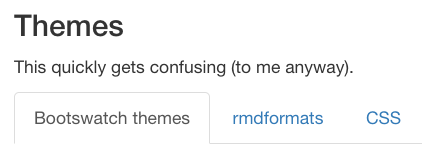
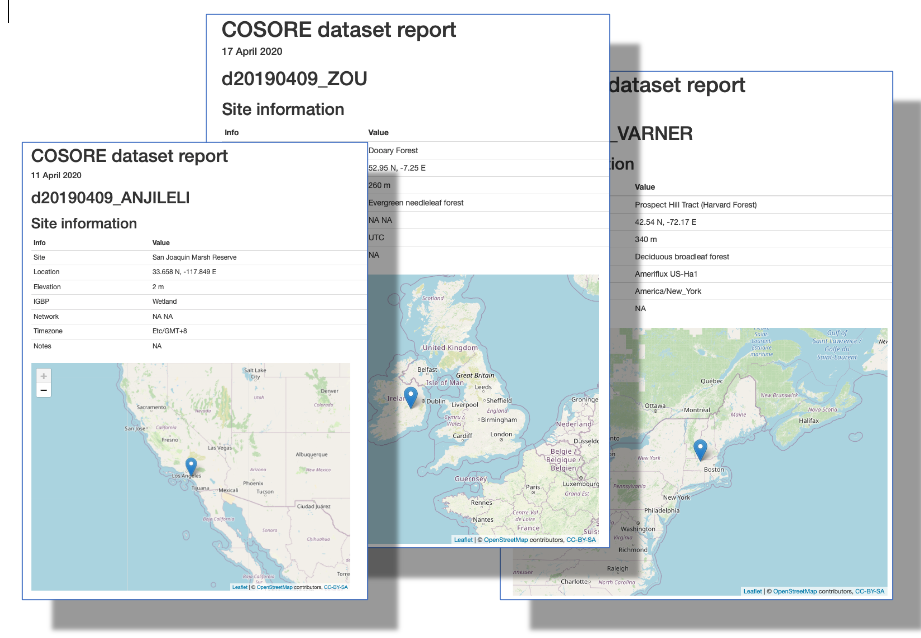

```{r arm-setup, include=FALSE}
knitr::opts_chunk$set(echo = TRUE)

library(ggplot2)
theme_set(theme_bw())
```

## Topics and goals

<------- Topics are to the left

**This workshop assumes (but ask questions as needed!) you are:**

* familiar with basic data structures and control structure of R: `data.frame`, `for`, function calls, parameters, etc. 
* comfortable with the idea, and basic mechanics, of R Markdown documents: how to make them, chunks and chunk options, inline code
* have heard of terms like [HTML](https://en.wikipedia.org/wiki/HTML)

**Goal: exposure to a variety of more advanced R Markdown techniques and tricks.**

Note that this is NOT intended to be a comprehensive survey of the possibilities with R Markdown.


## Under the hood {.tabset}

Disclaimer: I'm not an expert, and this quickly gets _really_ complex.

* `rmarkdown` is an R package for converting R Markdown documents into a variety of output formats
* Its `render()` function processes R Markdown input, creating a [Markdown](https://en.wikipedia.org/wiki/Markdown) (`*.md`) file
* This uses `knitr`, an R package for dynamic report generation with R.
* This is then transformed into HTML by [pandoc](https://pandoc.org/)
* R Markdown files have a [YAML](https://en.wikipedia.org/wiki/YAML) header giving configuration options that can apply to many stages of this pipeline

### R Markdown workflow


Original graphic from [The R Markdown Cookbook](https://bookdown.org/yihui/rmarkdown-cookbook/rmarkdown-process.html)

### Areas we'll be discussing


Original graphic from [The R Markdown Cookbook](https://bookdown.org/yihui/rmarkdown-cookbook/rmarkdown-process.html)


## HTML goodies

### TOC and code folding

Here's the YAML header for this presentation:

```
---
title: "Advanced R Markdown"
author: "BBL"
date: "`r "\u0060r format(Sys.time(), '%d %B %Y')\u0060"`"
output:
  html_document:
    toc: true
    toc_float: true
    code_folding: hide
---
```

**Things to notice:**

* The `date` field has inline R code to dynamically insert the current date
* The `html_document` setting for `output:` has three sub-settings:
  + `toc: true` generates a table of contents (based on `#` and `##` lines)
  + `toc_float: true` makes it 'floating'
  + `code_folding: hide` turns on code folding with a default of hidden code

```{r code-folding, fig.height=3}
ggplot(diamonds, aes(carat, fill = cut)) +
  geom_density(position = "stack")
```


### Tabs {.tabset}

You can use tabs to organize your content:

```
## Tabs {.tabset}

### Tab 1 name
(content)

### Tab 2 name
(content)
```

#### Cars

```{r cars}
plot(cars$speed, cars$dist)
```

#### Iris

```{r iris}
pairs(iris)
```

#### Volcano

```{r volcano}
image(volcano)
```

### Printing data frames

For HTML output only, you can add the `df_print: paged` parameter to your YAML header to
have printed data frames rendered as HTML tables.

```
output:
  html_document:
    df_print: paged
```

```{r mtcars}
mtcars
```

### Equations

Equations are (mostly) straightforward and based on [LaTeX mathematical typesetting](https://www.latex-project.org/):

R Markdown              | Final document
----------------------- | ------------------
`$x^{n}$`               | $x^{n}$
`$\frac{a}{b}$`         | $\frac{a}{b}$
`$\sum_{n=1}^{10} n^2$` | $\sum_{n=1}^{10} n^2$
`$\sigma \Sigma$`        | $\sigma \Sigma$

A handy summary is [here](https://www.calvin.edu/~rpruim/courses/s341/S17/from-class/MathinRmd.html).
_Extremely_ usefully, the RStudio editor provides has an equation preview feature.


### Static image files

These are inserted with a bit of HTML, e.g. for the image above:

``

There are lots of options that can be applied here, including size, whether the image floats, its justification, etc. See the `img` tag [documentation](https://www.w3schools.com/tags/tag_img.asp).


### Themes {.tabset}

This quickly gets confusing (to me anyway).

#### Bootswatch themes

These are built into `rmarkdown` so easy to use; themes are from the Bootswatch theme [library](https://bootswatch.com/3/). Just insert lines into your YAML header:

```
output:
  html_document:
    theme: sandstone
    highlight: tango
```




#### rmdformats

When the [rmdformats](https://github.com/juba/rmdformats) package is installed, it allows us create R Markdown documents using _very_ different themes.

```
output:
  rmdformats::readthedown:
    highlight: kate
```


There's also the [prettydoc](https://prettydoc.statr.me/) package.

#### Custom CSS

You can use a custom [Cascading Style Sheet (CSS)](https://en.wikipedia.org/wiki/Cascading_Style_Sheets) file. You're on your own here :)

[](https://en.wikipedia.org/wiki/Black_hole)


## knitr tricks


### combine_words

The first 10 letters are `` `r "\u0060r knitr::combine_words(LETTERS[1:10])\u0060"` ``.

The first 10 letters are `r knitr::combine_words(LETTERS[1:10])`.

### Chunk defaults

Most R Markdown documents (including this one) have a first chunk that, among other things, sets the _default chunk options_:

```
knitr::opts_chunk$set(echo = TRUE)
```

### Computable chunk options

Chunk options can take non-constant values; in fact, they can take values _from arbitrary R expressions_: 

````markdown
`r ''````{r}
# Define a global figure width value
my_fig_width <- 7
```

`r ''````{r, fig.width = my_fig_width}
plot(cars)
```
````

An example of R code in a chunk option setting:

````markdown
`r ''````{r}
width_small <- 4
width_large <- 7
small_figs <- TRUE
```

`r ''````{r, fig.width = if(small_figs) width_small else width_large}
plot(cars)
```
````

Here's a chunk that only executes when a particular package is available:

````markdown
`r ''````{r, eval = require("ggplot2")}
ggplot2::ggplot(cars, aes(speed, dist)) + geom_point()
```
````

More information [here](https://bookdown.org/yihui/rmarkdown-cookbook/chunk-variable.html).

### Child documents

R Markdown documents may be split, with a primary document incorporating others via a [child document](https://bookdown.org/yihui/rmarkdown-cookbook/child-document.html) mechanism. 

### Caching

Don't forget about the `cache=TRUE` chunk option. Critical for keeping the build time of longer, complex documents under control.

[](https://twitter.com/codinghorror/status/506010907021828096?s=20)

### Line breaks

_Two trailing spaces_ are used to force a line break:

This line **does not** has two spaces at the end.
The following line.

This line has two spaces at the end.  
The following line.

(This is actually part of the [Markdown spec](https://daringfireball.net/projects/markdown/syntax).)


## Programmatic reports

What if I want to run the same analysis, and/or generate the same report, for different datasets or conditions?



This offers the possibility of tremendously extending the utility of `rmarkown`!

### Parameters

R Markdown documents can take parameters. These are specified in the YAML header as a name followed by a default value:

```
params:
  cut: NULL
  min_price: 0
```

and can then be accessed by code in the document, via a read-only list called `params`:

```
print(params$min_price)
```

_Let's go make an R Markdown document_ that takes one or more parameters, for example to produce a report on some part of the `diamonds` dataset.

### render

So far so good, but how do we _use_ this capability programmatically?

The `rmarkdown::render()` function converts an input file to an output format, usually calling `knitr::knit()` and pandoc along the way.

```
rmarkdown::render("diamonds-report.Rmd", 
  params = list(cut = "Ideal"),
  output_file = "Ideal.html")
```

_Let's go make a driver script_ that generates an output file for each diamond cut in the dataset.

### Working directory issues

Because R Markdown files are parsed in a _separate_ R instance, the [working directory](https://bookdown.org/ndphillips/YaRrr/the-working-directory.html) is the _location of your R Markdown file_.

Don't mess with it via `setwd()`.

**Don't mess with it via `setwd()`.**


>If the first line of your #rstats script is setwd("C:\Users\jenny\path\that\only\I\have"), I will come into your lab and SET YOUR COMPUTER ON FIRE.  [Source](https://twitter.com/hadleywickham/status/940021008764846080)

**It's almost _always_ much better to use relative paths.** Absolute paths aren't robust and break reproducibility and transportability.

Note that `render` has an `output_dir` parameter.

Finally, check out the [here](https://github.com/jennybc/here_here) package, which
tries to figure out the top level of your current project using some sane heuristics.


## Neat R packages

### plotly

Interactive graphics.

```{r plotly, message=FALSE}
library(plotly)
p <- ggplot(mtcars, aes(hp, mpg, size = cyl, color = disp)) + geom_point()
ggplotly(p)
```

### DT

Handy if you want to sort or filter your table data.

```{r DT, message=FALSE}
library(DT)
library(gapminder)
datatable(mtcars, rownames = TRUE, filter = "top", 
          options = list(pageLength = 5, scrollX = TRUE))
```

Example based on [this post](https://holtzy.github.io/Pimp-my-rmd/#use_dt_for_tables).

### reactable

I haven't used the `reactable` package but it can make cool tables, and link those tables to data visualizations:

```{r, message=FALSE, warning=FALSE}
library(dplyr)
library(sparkline)
library(reactable)

data <- chickwts %>%
  group_by(feed) %>%
  summarise(weight = list(weight)) %>%
  mutate(boxplot = NA, sparkline = NA)

reactable(data, columns = list(
  weight = colDef(cell = function(values) {
    sparkline(values, type = "bar", chartRangeMin = 0, chartRangeMax = max(chickwts$weight))
  }),
  boxplot = colDef(cell = function(value, index) {
    sparkline(data$weight[[index]], type = "box")
  }),
  sparkline = colDef(cell = function(value, index) {
    sparkline(data$weight[[index]])
  })
))
```

More information [here](https://glin.github.io/reactable/).

### leaflet

I really like the simplicty of the `leaflet` package.

```{r leaflet, out.width='100%'}
library(leaflet)
leaflet() %>% 
  addTiles() %>%
  setView(-76.9219, 38.9709, zoom = 17) %>%
  addPopups(-76.9219, 38.9709,
            "Here is the <b>Joint Global Change Research Institute</b>")
```


## Citations and references

We might want to include citations. This is surprisingly easy; the source

```
In a subsequent paper [@Bond-Lamberty2009-py], we used the
same model outputs to examine the _hydrological_ implications
of these wildfire regime shifts [@Nolan2014-us]. 
Nolan et al. [-@Nolan2014-us] found that...
```

becomes:

>In a subsequent paper (Bond-Lamberty et al. 2009), we used the same model outputs to examine the _hydrological_ implications of these wildfire regime shifts (Nolan et al. 2014). Nolan
 et al. (2014) found that...
>
>**References**
>
>Bond-Lamberty, Ben, Scott D Peckham, Stith T Gower, and Brent E Ewers. 2009. “Effects of Fire on Regional Evapotranspiration in the Central Canadian Boreal Forest.” Glob. Chang. Biol. 15 (5): 1242–54.
>
>Nolan, Rachael H, Patrick N J Lane, Richard G Benyon, Ross A Bradstock, and Patrick J Mitchell. 2014. “Changes in Evapotranspiration Following Wildfire in Resprouting Eucalypt Forests.” Ecohydrol. 6 (January). Wiley Online Library.

To do this we include a new in (of course) the YAML header, for example:

```
---
bibliography: bibliography.json
---
```

While `*.json` is preferred, a wide variety of file formats can be accommodated:

Format      | File extension
----------- | -------
CSL-JSON    | .json
MODS        | .mods
BibLaTeX    | .bib
BibTeX      | .bibtex
RIS         | .ris
EndNote     | .enl
EndNote XML | .xml
ISI	        | .wos
MEDLINE     | .medline
Copac       | .copac

More details can be found [here](https://rmarkdown.rstudio.com/authoring_bibliographies_and_citations.html).


## Bookdown

Larger projects can become difficult to manage in a single R Markdown file (or even
one with child files).

The [bookdown](https://bookdown.org/yihui/rmarkdown/books.html) package (by the same [author](https://yihui.org/en/) as `rmarkdown`) offers several key improvements:

* Books and reports can be built from multiple R Markdown files
* Documents can easily be exported in a range of formats suitable for publishing, including PDF, e-books and HTML websites
* Additional formatting features are added, such as cross-referencing, and numbering of figures, equations, and tables

The last of these is so useful that it's available in R Markdown as well:

```
output: bookdown::html_document2
```

````markdown
`r ''````{r cars-plot, fig.cap = "An amazing plot"}
plot(cars)
```
````

````markdown
`r ''````{r mtcars-plot, fig.cap = "Another amazing plot"}
plot(mpg ~ hp, mtcars)
```
````

```
See Figure \@ref(fig:cars-plot).
```

>See Figure 1.

Theorems, equations, and tables can also be cross-referenced; see [the documentation](https://bookdown.org/yihui/bookdown/cross-references.html).


## Resources

Good resources:

* The [R Markdown Cheat Sheet](https://rstudio.com/wp-content/uploads/2015/02/rmarkdown-cheatsheet.pdf)
* The [R Markdown Cookbook](https://bookdown.org/yihui/rmarkdown-cookbook/)
* [15 Tips on Making Better Use of R Markdown](https://slides.yihui.org/2019-dahshu-rmarkdown#1)
* [How to Make Beautiful Tables in R](https://rfortherestofus.com/2019/11/how-to-make-beautiful-tables-in-r/)
* [Bookdown](https://bookdown.org/)


## The End

Thanks for attending this workshop on Advanced R Markdown! I hope it was useful.

This presentation was made using R Markdown version `r packageVersion("rmarkdown")` running under `r R.version.string`. It is available at https://rpubs.com/bpbond/630335. The code is [here](https://github.com/JGCRI/Rworkshops/blob/master/Advanced_RMarkdown.Rmd).

```{r sessionInfo}
sessionInfo()
```

