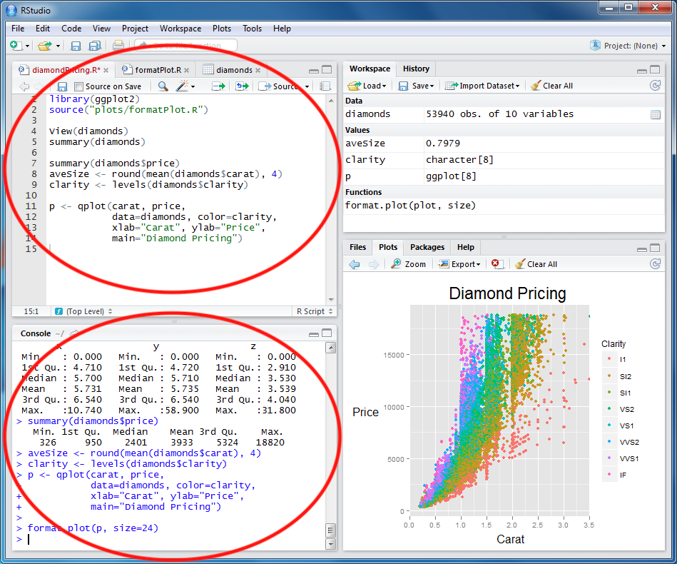
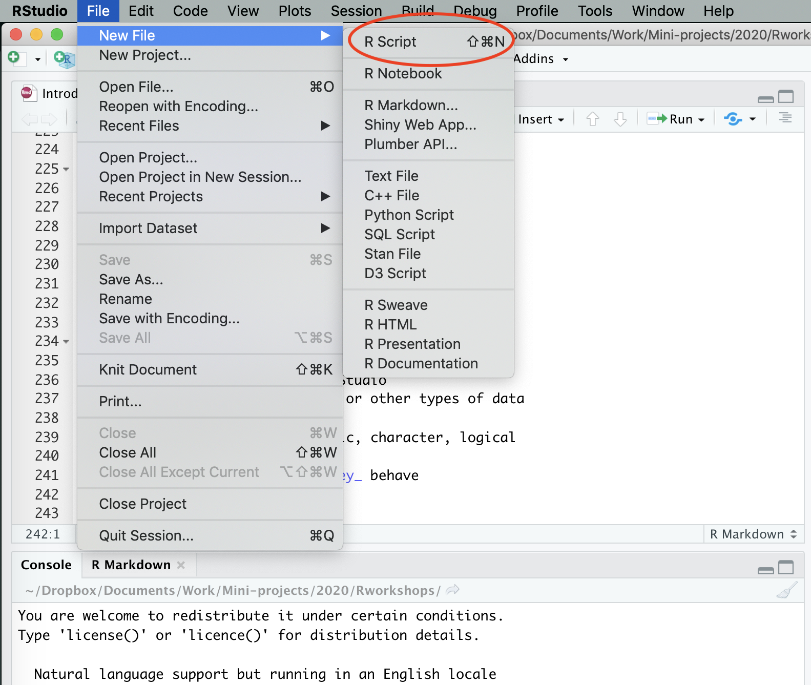
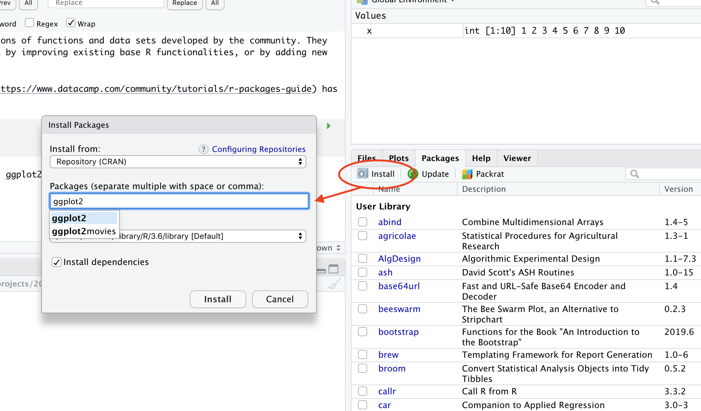
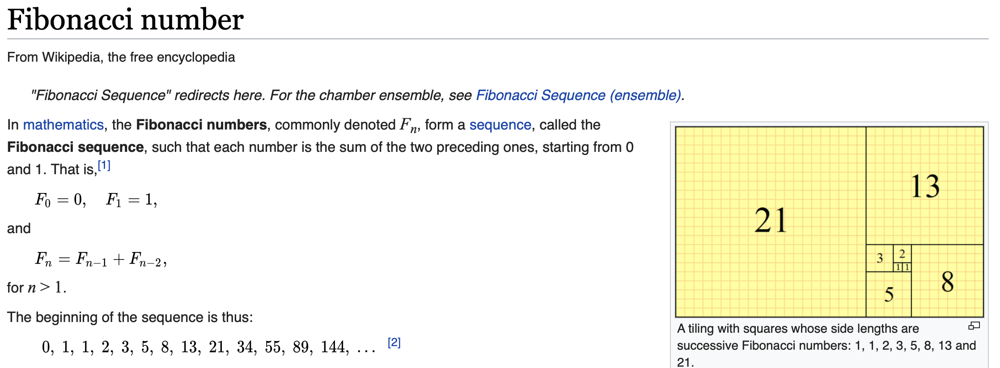

```{r setup, include=FALSE}
knitr::opts_chunk$set(echo = FALSE)
```

## Day 1 goals {.build data-background=#cceeff}

Introduce R

>- What it is, and why that goofy name
>- Understand a bit about R's capabilities and why people use it
>- Install R and RStudio and understand the difference between them
>- Start RStudio and look around

Do some computing in R

>- Objects: _variables_ and _functions_
>- Sequences (vectors) and making comparisons

## What is "R"?

>R is a **programming language and free software environment for statistical computing** and graphics supported by the R Foundation for Statistical Computing. The R language is widely used among statisticians and data miners for developing statistical software and data analysis.

https://en.wikipedia.org/wiki/R_(programming_language)

>R is named partly after the first names of the first two R authors and partly as a play on the name of [an earlier programming language called] S.

## Why use it?

R offers powerful and flexible _data processing_, beautiful _graphics_, and the ability to analyze data more more quickly and reproducibly than e.g. Excel.

```{r, out.width = "67%", echo=FALSE}
knitr::include_graphics("images/rstudio-windows.png")
```

## Why use it?

R is **command-line software**: you type and the computer (well, R) computes, displays figures...whatever you order it to do.

RStudio is a popular **interface** for R. It sits on top of R, and it allows users to more easily (for many people) interact with and use the underlying R.

Us <---> RStudio <---> R

## Installation

First, R: https://cran.r-project.org

Second, RStudio: https://rstudio.com/products/rstudio/

## Let's look around RStudio

In particular, we'll most use two parts of RStudio:

* The _console_
* The _editor_

```{r, out.width = "50%", echo=FALSE}

```

## Do something with R

We can type calculations into the _console_ and R will immediately respond:

```{r, echo=TRUE}
1 + 1
2 * 3
(135 + 2) ^ 3
```

## Do something with R {.build}

We can create a _sequence_ (or a _vector_):

```{r, echo=TRUE}
1:10
```

Oooooh. What will this do?

```{r, echo=TRUE}
1:10 * 2
```

What R is doing here is a fundamental characteristic of the langauge.

## Variables

Our first _variable_:

```{r, echo=TRUE}
x <- 1   # assign the value "1" to the name "x"
x
x * 3
```


```{r, echo=TRUE}
# R ignores anything after the '#' symbol
# These comments are a critical way to make code readable to PEOPLE
```

## Variables

We can have as many variables as we like (though there are some rules about naming them). If we re-assign their values, the old value is lost.

```{r, echo=TRUE}
my_variable <- 2 * 3 + 4
z <- my_variable
y <- 1000 + z
y <- 23
y
```

Note that `my_variable`, `x`, `y`, and `z` all refer to _separate objects_, whether or not they have identical values.

## Sequences

We saw `1:10` before but let's look at sequences (or _vectors_) a bit more.

```{r, echo=TRUE}
my_sequence <- 5:8
my_sequence[2:3]
```

Another way of making a vector, the `c()` notation:

```{r, echo=TRUE}
my_sequence <- c(5, 6, 7, 8)
my_sequence[2:3]
```

## Variables

Variables are often numeric, but don't have to be.

```{r, echo=TRUE}
a <- "hello"
a
b <- TRUE
print(b)
```

## Functions

Wait, what was the `print(b)` on the previous slide?

Very broadly, there are two kinds of objects: variables and **functions**.

Functions take inputs (technically called _parameters_) and produce an output. `print` is a function; so is `mean`:

```{r, echo=TRUE}
x <- c(1, 3, 4, 9)
mean(x)  # send 'x' to mean
```

## Functions

`sum` is similar. It take a sequence of numbers and returns a single value:

```{r, echo=TRUE}
x <- c(1, 3, 4, 9)
y <- x + 10
z <- sum(y)
print(z)
```

There are _lots_ of functions in R, and they are the fundamental workhorse of R computing.

## Comparisons

The double equals (`==`) is the standard in computer programming for making comparisons.

```{r, echo=TRUE}
1 == 1
"ben" == "handsome"
```

Ouch.

## Comparisons

We can compare a sequence, producing another sequence:

```{r, echo=TRUE}
x <- c(1, 3, 2, 2, 3)
x == 3
any(x == 3) # the 'any' function returns TRUE or FALSE
which(x == 3)
```

## Comparisons {.build}

What will this print? Why? Think about it before typing.

```{r, echo=TRUE}
x <- c(1, 3, 2, 2, 3)
x_two_values <- which(x == 2)
x_two_values
x[x_two_values]
x[-x_two_values]
```

## Summary

What have we learned today in the R language?

- R as a calculator
- Assigning variables
- Variables can have different types (numeric, character, logical, ...)
- Variables can be sequences of values
- Indexing sequences: `x[2]`
- Functions
- Making comparisons
- Comments

## Day 2 goals {data-background=#cceeff} 

- Review
- Making a _script_ to run code
- Control: `if` and `for`
- Data frames
- Functions

## Review and remember... {.build}

- The difference between R and RStudio
- Vectors (sequences) of numbers or other types of data
- Variables and how they behave
- Types of data/variables: numeric, character, logical
- Comparing data
- Built-in functions and how _they_ behave

## Scripts

<div class="columns-2">
  Create a new script file in RMarkdown and let's make a short _program_:
  
```{r, echo=TRUE, include=TRUE, eval=FALSE}
  x <- 1:10
  print(sum(x))
  print(paste("This is", x))
  
  plot(x)
```

  If you click `Source` in the upper-right of the window, R will execute
  your commands one by one.
  
  
  
  Scripts let us save work between sessions and generally make our lives easier.
</div>

## Flow control

We often want to execute parts of our code multiple times, or make choices.

R has a number of standard programming constructs to do this.

```{r, echo=TRUE}
x <- 5
if(x > 3) {
  # this block gets executed if the 'if' condition is TRUE
  print("Greater than 3")
} else {
  # ...and this if it's FALSE
  print("Less than or equal to 3")
}
```

## Flow control

`for` loops execute blocks of code multiple times.

This is _very_ common in programming. It's less used in R, because of R's
ability to do this 'in parallel' (e.g. `1:10 + 1`), but still sometimes 
necessary or just handy.

```{r, echo=TRUE}
for(i in 1:10) {
  print(paste("This is", i))   # we don't need a for loop to do this!
}
```

## Data frames

For many people this is the single most common data type they use in R.

It's a _table of data_, where each column can be a different type.

## Data frames

<div class="columns-2">

The `cars` dataset is one of many that comes with R.

```{r, echo=TRUE}
head(cars)
dim(cars)  # dimensions
summary(cars)
plot(cars$speed, cars$dist)
```

</div>

## Data frames

Accessing rows and columns and entries of a data frame:

```{r, echo=TRUE}
cars[1,]
cars[,1]
cars[1,2]
```

## Data frames

Accessing rows and columns and entries of a data frame:

```{r, echo=TRUE}
cars$speed
mean(cars$dist)
cars[1:3,]
```

## Data frames

We saw plotting in base R briefly a few slides ago:

```{r, echo=TRUE, eval=FALSE}
plot(cars$speed, cars$dist)
```

But we can make a _much_ nicer plot...so it's time to use our first R package!

## What's a package?

R packages are collections of functions and data sets developed by the community. They increase the power of R by improving existing base R functionalities, or by adding new ones.

(This [DataCamp page](https://www.datacamp.com/community/tutorials/r-packages-guide) has a good introduction.)

```{r, echo=TRUE}
library(ggplot2)
```

You may need to install ggplot2 first.



## Plotting cars

```{r, echo=TRUE}
library(ggplot2)  # load 'ggplot2' into our current library
qplot(speed, dist, data = cars)  # qplot is a function in ggplot2
```

## Plotting cars

```{r, echo=TRUE}
qplot(speed, dist, color = speed, data = cars)
```

## Plotting cars

```{r, echo=TRUE}
qplot(speed, dist, size = dist, data = cars)
```

## Plotting cars

```{r, echo=TRUE}
qplot(speed, dist, color = speed, size = dist, data = cars)
```

## Plotting cars

As long as we're talking about cars...

1. Take a look at the `mpg` dataset (included with ggplot2)
2. Use `summary` on it
3. Use `qplot` to plot. Try plotting displacement (on the x axis) versus city mileage (y axis), coloring by class of car
4. Try other plots!

Remember, `qplot` is part of the `ggplot2` _package_.

"A package is a like a book, a library is like a library; you use library() to check a package out of the library." [Source](https://twitter.com/hadleywickham/status/541948905009586176)

## Making our own functions

As we've seen, R has lots of built-in functions. These

* Take zero or more _inputs_
* Return zero or one _outputs_

```{r, eval=FALSE, echo=TRUE}
sum(1, 2) # 2 inputs -> 1 output
print(1)  # 1 input -> 0 outputs
```

But we can also write out _own_ functions.

## Making our own functions

```{r, echo=TRUE}
extract_row_1 <- function(x) {
  return(x[1,])
}

extract_row_1(cars)
extract_row_1(iris)
```

## Making our own functions

Functions have their own "scope". **This is important.**

```{r, echo=TRUE, eval=FALSE}
x <- 1
f <- function(x) {
  print(x)
}
f(2)  # what gets printed?
```

Another example:

```{r, echo=TRUE, eval=FALSE}
x <- 1
y <- 2
f <- function(x) {
  y <- x
}
f(2)  # what are the values of x and y after this?
```

## Exercises {.build}

Write a function that take two parameters, `x` and `n`, and
returns the nth row of x.

```{r, echo=TRUE}
extract_row <- function(x, n) {
  return(x[n,])
}

extract_row(cars, 2)
```

## Exercises: Fibonacci {.build}

Write a function that computes the nth [Fibonacci number](https://en.wikipedia.org/wiki/Fibonacci_number).



This is a classic problem in computer science. It also slightly tricky, and interesting...let's do it together.

## Exercises: Fibonacci

```{r, echo=TRUE}
fibonacci <- function(n) {
  if(n < 0) {
    stop("Error! n has to be positive")
  } else if(n == 0) {
    return(0)
  } else if(n == 1) {
    return(1)
  } else {
    return(fibonacci(n - 1) + fibonacci(n - 2))
  }
}
```

Whoah! A function calling itself. This is called _recursion_.

## Exercises: Fibonacci

```{r, echo=TRUE}
fibonacci(2)
fibonacci(3)
fibonacci(12)
# try this: fibonacci(-1)
```

## Day 3 goals {data-background=#cceeff} 

- Review
- RStudio projects
- Reading data into R
- The `aggregate` function
- More plotting
- Saving graphs and data

## Review and remember... {.build}

- Types of variables and how they behave
- Functions, both built in and ones we write
- Scripts - writing, saving, running
- Program flow: `if...else` and `for`
- Vectors and data frames - bracket subsetting
- Missing values: `NA`
- Packages
- Visualizing data using `ggplot2`

## RStudio projects

RStudio projects make it straightforward to divide your work into multiple contexts.

RStudio projects are associated with R _working directories_. You can create an RStudio project:

* In a brand new directory
* In an existing directory where you already have R code and data
* By cloning a version control (Git or Subversion) repository

Let's create a new project for our work today.

## RStudio projects

The _working directory_ of our project is set to the project folder.

```{r, echo=TRUE}
getwd()
list.files()
```

All reading and writing takes place starting here.

You _can_ set the working directory (see `?setwd`) but I strongly discourage this.

## Reading data into R

Data files come in lots of different formats:

* image files
* tabular data
* binary data
* text

Which you use depends on your task, the format the dataset is provided in, and other factors.

## Reading data into R

<div class="columns-2">

_Tabular data_ are a perfect match for our data frames, and are very common, so let's start with that.
The most common form of these is CSV (comma separated values).

Download a sample data file:

https://github.com/JGCRI/Rworkshops

Note: I put this file in the _repository_ for these workshops. The original
file is [here](https://people.sc.fsu.edu/~jburkardt/data/csv/deniro.cs).


</div>

## Reading data into R

What does `deniro.csv` look like? 

```{r}
cat(readLines("deniro.csv", n = 5), sep = "\n")
```

We use the `read.csv` function read it into R:

```{r, echo=TRUE}
deniro <- read.csv("deniro.csv")
```

Note that read.csv can also read directly from the Internet!

```{r, echo=TRUE}
deniro <- read.csv("https://people.sc.fsu.edu/~jburkardt/data/csv/deniro.csv")
```

## Exploring `deniro` {.build}

Use `head`, `tail`, and `summary` to look at the De Niro data.

Use bracket notation to look at which films he made in 1990

```{r, echo=TRUE}
which_years_are_1990 <- deniro$Year == 1990
deniro[which_years_are_1990,]
```

## Exploring `deniro`

Another way to do this is using R's `subset` command.

```{r, echo=TRUE}
subset(deniro, Year == 1990)
```

Play around with `subset` a bit. Subset his 'good' and 'bad' films, recent and old ones.

## A script

Let's write a script that

- reads in `deniro`
- prints a summary of the dataset
- assign a good/ok/bad label to each movie
- plots scores by year, coloring by category
- saves the plot
- calculates how movies there are of each category   <-- this is new
- saves his good films (Rotten Tomatoes score >90)

## Read in `deniro` and summarize {.build}

Hint: use `read.csv` and `summary`

```{r, echo=TRUE}
deniro <- read.csv("deniro.csv")

print(summary(deniro))
```

## Assign labels to each movie {.build}

Hint: use a logical vector

```{r, echo=TRUE}
print(paste("Total movies:", nrow(deniro)))
goods <- deniro$Score > 80
print(paste("Good movies:", sum(goods)))
bads <- deniro$Score < 20
print(paste("Bad movies:", sum(bads)))

# Assign good/okay/bad categories

deniro$Category <- "Okay"
deniro$Category[goods] <- "Good"
deniro$Category[bads] <- "Bad"
```

## Plot our data! {.build}

We'll use `qplot` in the `ggplot2` package

```{r, echo=TRUE, fig.height=4}
library(ggplot2)
print(qplot(Year, Score, color = Category, data = deniro))
ggsave("deniro.pdf")
```

## Summarize the data {.build}

This is something we haven't seen before.

```{r, echo=TRUE, fig.height=4}
howmany <- aggregate(Score ~ Category, data = deniro, FUN = length)
print(howmany)
```

## Save the good movies {.build}

Because we need something to watch while in quarantine.

```{r, echo=TRUE, fig.height=4}
good_movies <- subset(deniro, goods)
write.csv(good_movies, "good_deniro_films.csv")
list.files()
```

