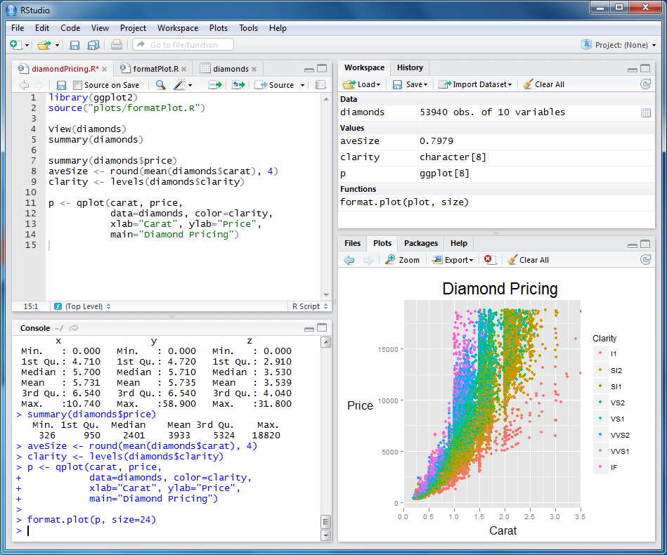

```{r setup, include=FALSE}
knitr::opts_chunk$set(echo = FALSE)
```

## Day 1 goals {.build}

Introduce R

>- What it is, and why that goofy name
>- Understand a bit about R's capabilities and why people use it
>- Install R and RStudio and understand the difference between them
>- Start RStudio and look around

Do some computing in R

>- Objects: _variables_ and _functions_
>- Sequences (vectors) and making comparisons

## What is "R"?

>R is a **programming language and free software environment for statistical computing** and graphics supported by the R Foundation for Statistical Computing. The R language is widely used among statisticians and data miners for developing statistical software and data analysis.

https://en.wikipedia.org/wiki/R_(programming_language)

>R is named partly after the first names of the first two R authors and partly as a play on the name of [an earlier programming language called] S. The project was conceived in 1992, with an initial version released in 1995 and a stable beta version (v1.0) on February, 29th 2000.

## Why use it?

R offers powerful and flexible _data processing_, beautiful _graphics_, and the ability to analyze data more more quickly and reproducibly than e.g. Excel.

```{r, out.width = "67%", echo=FALSE}

```

## Why use it?

R is command-line software: you type and the computer (well, R) computes, displays figures...whatever you order it to do.

RStudio is a popular _interface_ for R. It sits on top of R, and it allows users to more easily (for many people) interact with and use the underlying R.

Us <---> RStudio <---> R

## Installation

First, R: https://cran.r-project.org

Second, RStudio: https://rstudio.com/products/rstudio/

## Let's look around RStudio

In particular, we'll most use two parts of RStudio:

* The _console_
* The _editor_

```{r, out.width = "50%", echo=FALSE}

```

## Do something with R

We can type calculations into the _console_ and R will immediately respond:

```{r, echo=TRUE}
1 + 1
2 * 3
(135 + 2) ^ 3
```

## Do something with R {.build}

We can create a _sequence_ (or a _vector_):

```{r, echo=TRUE}
1:10
```

Oooooh. What will this do?

```{r, echo=TRUE}
1:10 * 2
```

What R is doing here is a fundamental characteristic of the langauge.

## Variables

Our first _variable_ and our first _comment_ explaining what's going on:

```{r, echo=TRUE}
x <- 1   # assign the value "1" to the name "x"
x
x * 3
```


```{r, echo=TRUE}
# R ignores anything after the '#' symbol
# These comments are a critical way to make code readable to PEOPLE
```

## Variables

We can have as many variables as we like (though there are some rules about naming them):

```{r, echo=TRUE}
my_variable <- 2 * 3 + 4
z <- my_variable
y <- 1000 + z
y <- 23
y
```

Note that `my_variable`, `x`, `y`, and `z` all refer to _separate objects_, whether or not they have identical values.

## Sequences

We saw `1:10` before but let's look at sequences (or _vectors_) a bit more.

```{r, echo=TRUE}
my_sequence <- 5:8
my_sequence[2]
my_sequence <- c(5, 3, 9, 1)
my_sequence[1:2]
```

Here we also see another way of making a vector, the `c()` notation.

## Variables

Variables are often numeric, but don't have to be.

```{r, echo=TRUE}
a <- "hello"
a
b <- TRUE
print(b)
```

## Functions

Wait, what was the `print(b)` on the previous slide?

Very broadly, there are two kinds of objects: variables and **functions**.

Functions take inputs (technically called _parameters_) and produce an output.

```{r, echo=TRUE}
x <- c(1, 3, 4, 9)
mean(x)
```

## Functions

```{r, echo=TRUE}
x <- c(1, 3, 4, 9)
mean(x)
```

This the `mean` function, sending it the _object_ `x` and getting back its result.

```{r, echo=TRUE}
x <- c(1, 3, 4, 9)
y <- x + 10
z <- sum(y)
print(z)
```

## Comparisons

The double equals (`==`) is the standard in computer programming for making comparisons.

```{r, echo=TRUE}
1 == 1
"ben" == "handsome"
```

Ouch.

## Comparisons

We can compare a sequence, producing another sequence:

```{r, echo=TRUE}
x <- c(1, 3, 2, 2, 3)
x == 3
any(x == 3)
which(x == 3)
```

This nicely demonstrates R's `any` and `which` functions.

## Comparisons {.build}

What will this print? Why? Think about it before typing.

```{r, echo=TRUE}
x <- c(1, 3, 2, 2, 3)
x_two_values <- which(x == 2)
x[x_two_values]
```

## Summary

What have we learned today in the R language?

- R as a calculator
- Assigning variables
- Variables can have different types (numeric, character, logical, ...)
- Variables can be sequences of values
- Indexing sequences: `x[2]`
- Functions
- Making comparisons
- Comments
