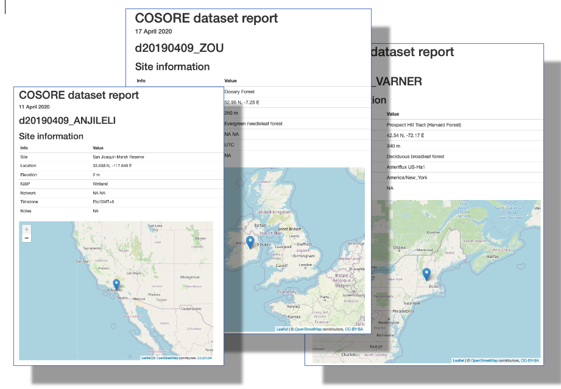
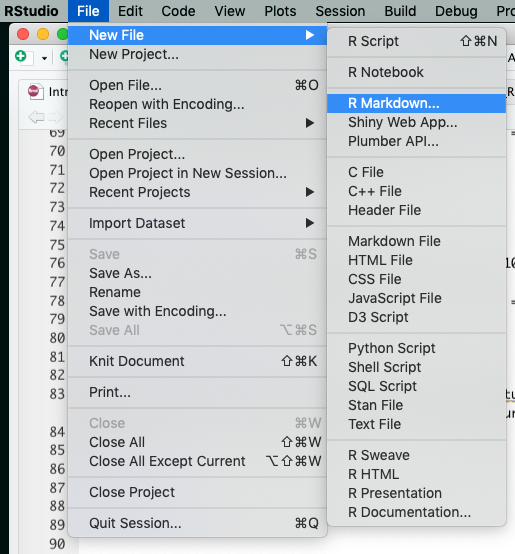
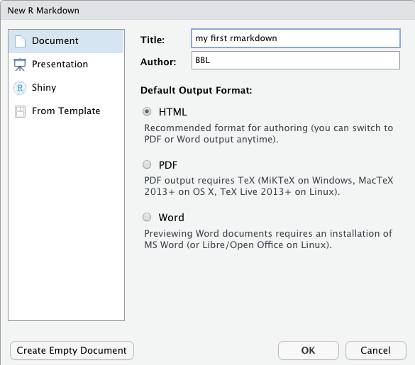
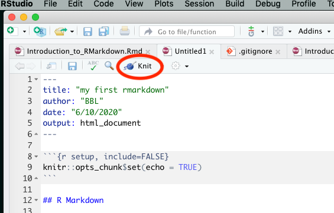
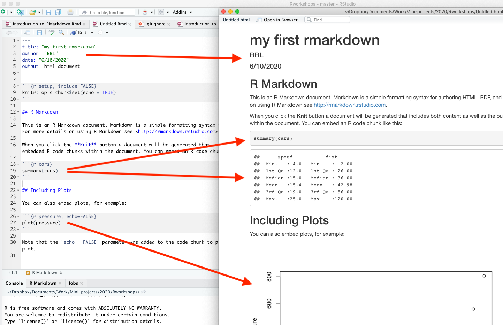
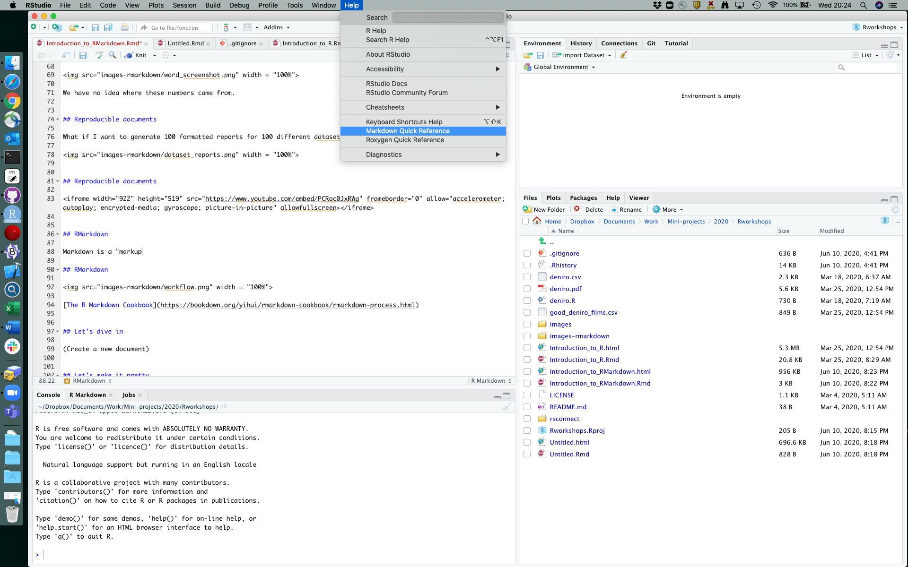
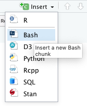
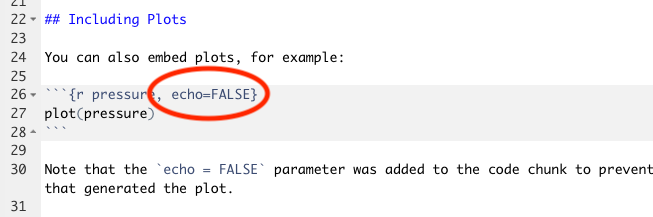
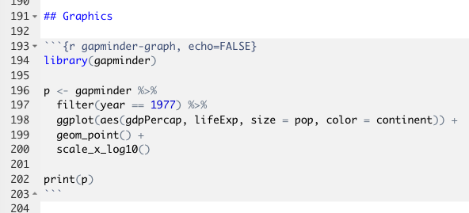
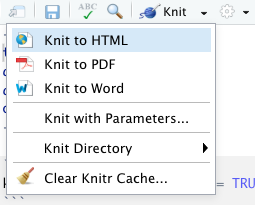

```{r setup, include=FALSE}
knitr::opts_chunk$set(echo = FALSE)

library(dplyr)
library(ggplot2)
theme_set(theme_bw())
```

## Topics {data-background=#cceeff}

* Concept of reproducible documents
* R Markdown (and Markdown)
* Running code _inline_ and via _code chunks_
* Graphics and tables
* Output formats
* Fancier things
* Resources

**Goal: to be comfortable making basic reproducible documents.**


## Assumptions

* You're familiar with the basic mechanics of R

This is intended to be a hands-on workshop, so also:

* You have R (and probably RStudio) installed
* You have the [rmarkdown](https://cran.r-project.org/web/packages/rmarkdown/index.html) package installed


## Reproducible documents {data-background=#cceeff}

_What_ are reproducible documents?

"A reproducible document is one where any code used by the original researcher to compute an output (a graph, equation, table or statistical result) is embedded within the narrative describing the work."

From the [eLife Reproducible Document Stack](https://elifesciences.org/labs/7dbeb390/reproducible-document-stack-supporting-the-next-generation-research-article)


## Reproducible documents

Here we are in Word:


We have _no idea_ where these numbers came from.


## Reproducible documents

Copy-and-paste into word processing documents _sucks_, and it's easy to make mistakes (not update numbers, copy the wrong number, etc).


## Reproducible documents

What if I want to generate 100 formatted reports for 100 different datasets?




## Reproducible documents

<div style="float: left; width: 50%;">
_Why_ do we want to use reproducible documents?

* Transparency
* Reproducibility
* Reduce mistakes
* **SAVE TIME AND WORK**
</div>

<div style="float: right; width: 50%;">


[xkcd](https://xkcd.com/1319/)
</div>


## Reproducible documents

<iframe width="922" height="519" src="https://www.youtube.com/embed/PCRoc0JxRWg" frameborder="0" allow="accelerometer; autoplay; encrypted-media; gyroscope; picture-in-picture" allowfullscreen></iframe>


## R Markdown {data-background=#cceeff}

R Markdown is an easy-to-write plain text format for creating dynamic documents and reports.

It's designed to let us mix _text_ and _code_ to produce a [Markdown](https://en.wikipedia.org/wiki/Markdown) document, that is then transformed into a final output


## R Markdown: under the hood


[The R Markdown Cookbook](https://bookdown.org/yihui/rmarkdown-cookbook/rmarkdown-process.html)


## Let's dive in




## Let's dive in




## Let's dive in

What do we have? A _text document_ (the R Markdown file).




## Let's dive in

What happened?




## Text: Markdown

```
# A big header
## A smaller one
### Smaller still
A [link](https://daringfireball.net/projects/markdown/).
A sentence with _italics_ in it. **Boldface.**
```

A [link](https://daringfireball.net/projects/markdown/). A sentence with _italics_ in it. **Boldface.**


https://xkcd.com/1285/


## Text: Markdown




## Code: inline

R code in Markdown documents can be _inline_ or in _code chunks_.

Inline code uses backticks, inside of which is an R expression that starts with "r". It is typically used for something short:

* These slides were made with `` `r "\u0060r R.version.string\u0060"` ``.

* These slides were made with `r R.version.string`.

* Two plus two equals `` `r "\u0060r 2+2\u0060"` ``.

* Two plus two equals `r 2+2`.

You can also easily insert equations like $\sum_{n=1}^{10} n^2$


## Code: chunks

The other mechanism to include R code in your document is via code chunks. These are evaluated by `knitr` and the results inserted into your document.

Let's try this!

**Two important notes:**

* You can give chunks individual names, which makes it easier to navigate around longer documents.
* RStudio has nice controls for running individual chunks.


## Code: chunks

Side note: code chunks don't have to be in R!



```{bash bash-no-eval, echo=TRUE, eval=FALSE}
ls *.Rmd
```

```{bash bash}
ls *.Rmd
```


## Chunk options

We can control the behavior of code chunks by using _chunk options_ (settings). Some common ones include:

Option  | Default  | Effect
------- | -------- | --------
eval    | TRUE     | Whether to evaluate the chunk's code
echo    | TRUE     | Whether to display chunk's code
include | TRUE     | Whether to include chunk output
message | TRUE     | Whether to display chunk messages
cache   | FALSE    | Whether to cache results


## Chunk options

Try inserting a new chunk with the code `dim(iris)`. 

What happens if you set `eval=FALSE`? What about `echo=FALSE`? 

Why?




## Graphics

Say we have a figure we want to include:

```{r gapminder-chunk, echo=TRUE, eval=FALSE}
library(gapminder)

p <- gapminder %>%
  filter(year == 1977) %>%
  ggplot(aes(gdpPercap, lifeExp, size = pop, color = continent)) +
  geom_point() +
  scale_x_log10() +
  ggtitle("gapminder 1977")

print(p)
```


## Graphics

```{r gapminder-graph, echo=FALSE}
library(gapminder)

p <- gapminder %>%
  filter(year == 1977) %>%
  ggplot(aes(gdpPercap, lifeExp, size = pop, color = continent)) +
  geom_point() +
  scale_x_log10()

print(p)
```


## Graphics (behind the scenes)




## Graphics

Let's add a graph to your document.

Note there are chunk options `fig.cap`, `fig.width`, and `fig.height` you can change.


## Tables

Tables can be made by hand (see the Markdown help page), but usually we have a data frame that we want to display. 

The simplest method uses `knitr`'s built-in `kable()` function:

```{r simple-table}
knitr::kable(iris)
```


## Output formats

We haven't really talked about [pandoc](https://pandoc.org/), the software that transforms Markdown into an output format of our choice.



Use the Knit menu button, or the `output:` line in the YAML header, to change the output format to e.g. `word_document" or "pdf_document".

These may require extra software to be installed.


## Session info

For reproducibility, it is a good practice to call `sessionInfo()` at the end of your document. Like this:

```{r sessioninfo, echo=TRUE}
sessionInfo()
```


## Fancier things to whet your appetite {data-background=#cceeff}

This has been the tip of the iceberg.


## Fancier things: interactive graphs

```{r plotly, message=FALSE}
library(plotly)

p <- gapminder %>%
  filter(year == 1977) %>%
  ggplot(aes(gdpPercap, lifeExp, size = pop, color = continent)) +
  geom_point() +
  scale_x_log10() +
  theme_bw() +
  ggtitle("gapminder 1977")
 
ggplotly(p)
```


## Fancier things: interactive tables

```{r DT, message=FALSE}
library(DT)
datatable(gapminder, rownames = FALSE, filter = "top", 
          options = list(pageLength = 5, scrollX = TRUE)) %>% 
  formatStyle(columns = 1:6, fontSize = "50%")
```

\
This takes _~~one~~ two_ lines of code in RMarkdown. Example based on [this post](https://holtzy.github.io/Pimp-my-rmd/#use_dt_for_tables).


## Fancier things: interactive maps

```{r leaflet, out.width='100%', echo=FALSE}
library(leaflet)
leaflet() %>% 
  addTiles() %>%
  setView(-76.9219, 38.9709, zoom = 17) %>%
  addPopups(-76.9219, 38.9709,
            "Here is the <b>Joint Global Change Research Institute</b>")
```


## Fancier things: citation management

```
In a subsequent paper [@Bond-Lamberty2009-py], we used the same model 
outputs to examine the _hydrological_ implications of these wildfire 
regime shifts [@Nolan2014-us].
```
 In a subsequent paper (Bond-Lamberty et al. 2009), we used the same model outputs to examine the _hydrological_ implications of these wildfire regime shifts (Nolan et al. 2014).

**References**

Bond-Lamberty, Ben, Scott D Peckham, Stith T Gower, and Brent E Ewers. 2009. “Effects of Fire on Regional Evapotranspiration in the Central Canadian Boreal Forest.” Glob. Chang. Biol. 15 (5): 1242–54.

Nolan, Rachael H, Patrick N J Lane, Richard G Benyon, Ross A Bradstock, and Patrick J Mitchell. 2014. “Changes in Evapotranspiration Following Wildfire in Resprouting Eucalypt Forests.” Ecohydrol. 6 (January). Wiley Online Library.


## Resources

Good resources:

* The [R Markdown Cheat Sheet](https://rstudio.com/wp-content/uploads/2015/02/rmarkdown-cheatsheet.pdf)
* The [R Markdown Cookbook](https://bookdown.org/yihui/rmarkdown-cookbook/)
* [15 Tips on Making Better Use of R Markdown](https://slides.yihui.org/2019-dahshu-rmarkdown#1)
* [Stack Overflow](https://stackoverflow.com/questions/tagged/r-markdown) of course
* Allison Hill's [How I Teach R Markdown](https://alison.rbind.io/post/2020-05-28-how-i-teach-r-markdown/)
* [How to Make Beautiful Tables in R](https://rfortherestofus.com/2019/11/how-to-make-beautiful-tables-in-r/)


## The End {data-background=#cceeff}

Thanks for attending this introduction to R Markdown documents workshop! We hope it was useful.

This presentation was made using R Markdown version `r packageVersion("rmarkdown")` running under `r R.version.string`.

These slides are available at https://rpubs.com/bpbond/626346. (And they were written in R Markdown! The code is [here](https://github.com/JGCRI/Rworkshops/blob/master/Introduction_to_RMarkdown.Rmd).)

