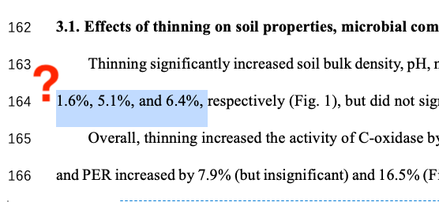
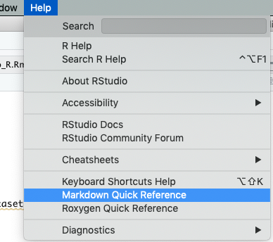

```{r setup, include=FALSE}
knitr::opts_chunk$set(echo = FALSE)
```

## Day 1 goals {.build data-background=#cceeff}

Topics will include

>- Concept of reproducible documents
>- R Markdown (and Markdown)
>- Simple examples
>- Making your own: code chunks and inline code
>- Output formats
>- Graphics
>- Simple tables
>- Sesssion info
>- A more complicated example


## Assumptions

* You're familiar with the basic mechanics of R
* You have R and RStudio installed
* You have the [rmarkdown](https://cran.r-project.org/web/packages/rmarkdown/index.html) package installed


## Reproducible documents {data-background=#cceeff}

_What_ are reproducible documents?

>A reproducible document is one where any code used by the original researcher to compute an output (a graph, equation, table or statistical result) is embedded within the narrative describing the work

From the [eLife Reproducible Document Stack](https://elifesciences.org/labs/7dbeb390/reproducible-document-stack-supporting-the-next-generation-research-article)


## Reproducible documents

<div style="float: left; width: 50%;">
_Why_ do we want to use reproducible documents?

* Transparency
* Reproducibility
* **THEY SAVE US TIME AND WORK**
</div>

<div style="float: right; width: 50%;">


[xkcd](https://xkcd.com/1319/)
</div>


## Reproducible documents

Here we are in Word:



We have no idea where these numbers came from.


## Reproducible documents

What if I want to generate 100 formatted reports for 100 different datasets?


## Reproducible documents

<iframe width="922" height="519" src="https://www.youtube.com/embed/PCRoc0JxRWg" frameborder="0" allow="accelerometer; autoplay; encrypted-media; gyroscope; picture-in-picture" allowfullscreen></iframe>


## R Markdown {data-background=#cceeff}

R Markdown is an easy-to-write plain text format for creating dynamic documents and reports.

It's designed to let us mix _text_ and _code_ to produce a [Markdown](https://en.wikipedia.org/wiki/Markdown) document, that then is transformed into a final document.


## R Markdown: under the hood


[The R Markdown Cookbook](https://bookdown.org/yihui/rmarkdown-cookbook/rmarkdown-process.html)


## Let's dive in


## Let's dive in


## Let's dive in

What do we have? A _text document_ (the R Markdown file).


## Let's dive in

What happened?


## Let's make it pretty

(TODO: immediately apply a theme, or something, to wow them?)


## Text: Markdown

```
# A big header
## A smaller one
### Smaller still
A [link](https://daringfireball.net/projects/markdown/).
A sentence with _italics_ in it.
```

A [link](https://daringfireball.net/projects/markdown/). A sentence with _italics_ in it.




## Code: inline

TODO: go over differences.

Two plus two equals `r 2+2`.

```{r addition}
2+2
```

TODO: have them insert an inline statement or two.


## Code: chunks

TODO: have them insert a new chunk.


## Chunk options

TODO


## Graphics

TODO


## Tables

TODO


## Themes, etc.

There's lots you can do here if you want to get fancy... TODO


## Output formats

TODO


## Fancier things to whet your appetite

```{r, message=FALSE}
library(ggplot2)
library(plotly)
library(gapminder)
 
p <- gapminder %>%
  filter(year == 1977) %>%
  ggplot( aes(gdpPercap, lifeExp, size = pop, color=continent)) +
  geom_point() +
  scale_x_log10() +
  theme_bw() +
  ggtitle("gapminder 1977")
 
ggplotly(p)
```


## Fancier things to whet your appetite

```{r, message=FALSE}
library(DT)
datatable(gapminder, rownames = FALSE, filter = "top", options = list(pageLength = 5, scrollX = TRUE))
```

Based on [this example](https://holtzy.github.io/Pimp-my-rmd/#use_dt_for_tables).


## Session info

For reproducibility, it is a good practice to call `sessionInfo()` at the end of your document. Like this:

```{r, echo=TRUE}
sessionInfo()
```


## The End {data-background=#cceeff}

Thanks for attending this introduction to R Markdown documents workshop! We hope it was useful.

This presentation was made using R Markdown version `r packageVersion("rmarkdown")` running under `r R.version.string`.

These slides are available at https://rpubs.com/bpbond/626346. (And they were written in R Markdown! The code is [here](https://github.com/JGCRI/Rworkshops/blob/master/Introduction_to_RMarkdown.Rmd).)

An invaluable resource: the [R Markdown Cheat Sheet](https://rstudio.com/wp-content/uploads/2015/02/rmarkdown-cheatsheet.pdf).
