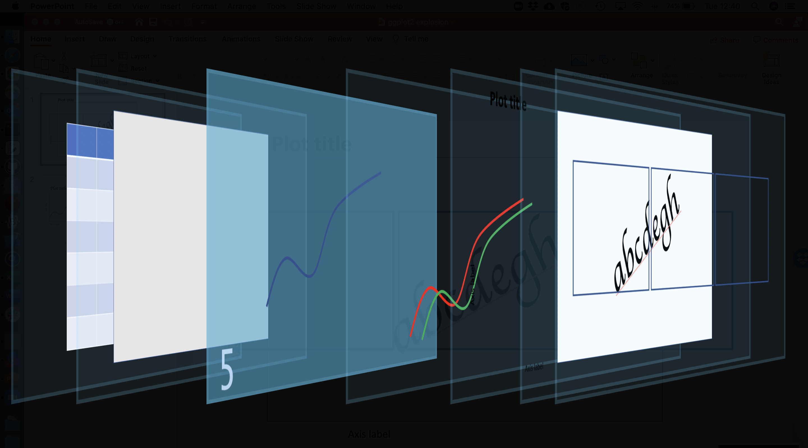

```{r setup, include=FALSE}
knitr::opts_chunk$set(echo = TRUE)
```


## Topics {data-background=#cceeff}

* Data visualization concepts
* A grammar of graphics
* An introduction to ggplot2
* The pieces of a ggplot2 plot
* Implications for data structure
* Data, aesthetics, geoms, labels, themes, facets
* Accessibility
* Saving plots
* Fancier things
* Resources

**Goal: to be comfortable making basic reproducible documents.**


## Assumptions

<span style="color: red;">**We assume you're familiar with the basic mechanics of R:**</span>

* Starting R/RStudio
* Scripts, variables, and data frames

So _not_ at this level :)


**This is intended to be a hands-on workshop**, so we also assume:

* You have R (and probably RStudio) installed
* You have the [ggplot2](https://cran.r-project.org/web/packages/ggplot2/index.html) package installed


# Data visualization

- Visualizing data is critical! 
    example from https://towardsdatascience.com/a-comprehensive-guide-to-the-grammar-of-graphics-for-effective-visualization-of-multi-dimensional-1f92b4ed4149
   
General concepts of effective data visualization

- Who is audience, what are you trying to communicate, etc.

- Importance of accessibility

## R plotting pre-ggplot2

One of the simplest datasets included with R is `cars`:

```{r plot-cars, warning=FALSE}
library(tibble)
as_tibble(cars)
plot(cars)
```

That seems pretty good! What's the problem?

Well, what about `iris`? This is a [famous](https://rpubs.com/AjinkyaUC/Iris_DataSet) dataset:

```{r show-iris, warning=FALSE}
as_tibble(iris)
```


Let's plot two of its columns against each other:

```{r plot-iris}
plot(iris$Sepal.Length, iris$Sepal.Width, col = iris$Species)
legend(7, 4.3, 
       unique(iris$Species),
       col=1:length(iris$Species), 
       pch = 1)
```

This is a bunch of code for such a simple plot; note that:

* The `plot` code understands numeric vectors, so we need to repeatedly specify `iris$<column>`
* This means the default axis labels are ugly (though they can be changed)
* The legend is _totally disconnected_ from the plot: we have to do everything (color
assignment, etc.) manually

Things quickly gets worse if we want more complexity or features.


# A grammar of graphics

- Origin

- Idea of mapping aesthetics

>To be precise, the layered grammar defines the components of a plot as:
>
>* a default dataset and set of mappings from variables to aesthetics,
>* one or more layers, with each layer having one geometric object, one statistical transformation, one position adjustment, and optionally, one dataset and set of aesthetic mappings,
>* one scale for each aesthetic mapping used,
>* a coordinate system,
>* the facet specification.

From Hadley's book https://vita.had.co.nz/papers/layered-grammar.pdf

# The ggplot2 package


# Steps to a ggplot2 plot


## Setup: the dataset


- Implications for how we structure our data (long versus wide)

## The ggplot call


Let's call `ggplot()` using the iris dataset!

```{r ggplot-call}
library(ggplot2)
ggplot(iris)
```

Well, that was a bit disappointing.

## The aesthetics mapping


The aesthetics mapping

## Interlude: data structure

This idea of mapping aesthetics to variables has implications for our data structure.

Remember what `iris` look like:

```{r show-iris-again, warning=FALSE, echo=FALSE}
iris
```

This is problematic. What if we wanted an aesthetic like `color` to depend on what dimension or organ we're measuring?

### Long/tidy data

With all this in mind, it's clear we need to _reshape_ our data.

```{r}
iris_long <- reshape(iris, 
                     varying = c("Sepal.Length", 
                                 "Sepal.Width",
                                 "Petal.Length",
                                 "Petal.Width"), 
                     timevar = "dimension",
                     direction = "long")
iris_long
```

With this reshaping, we can map an _aesthetic_ to a _column_.

**QUESTION.** Which columns are likely candidates for aesthetics? Why? 

```{r}
iris_plot <- ggplot(iris_long, aes(x = Sepal, y = Petal, color = Species))
```

## The geom(s)



- Spend time here. Demonstrate different geoms applied to same data
- If you define aesthetics in geoms they _override_ the base plot aesthetics

### Let's try different geoms {.tabset}

#### geom_point

```{r iris-plot-point}
iris_plot + geom_point()
```

#### geom_line

```{r iris-plot-line}
iris_plot + geom_line()
```

#### geom_bin2d

```{r iris-plot-bin2d}
iris_plot + geom_bin2d()
```

#### geom_hex

```{r iris-plot-hex}
iris_plot + geom_area()
```

#### geom_violin

```{r iris-plot-violin}
iris_plot + geom_violin()
```

#### geom_dotplot

```{r iris-plot-dotplot, error=TRUE}
iris_plot + geom_dotplot()
```


## The labels


- ggplot makes default labels from columns
- xlab, ylab, ggtitle

## The themes


- can apply many pre-made themes
- examples
- more available online, e.g. xkcd theme

## The facets


- facet_wrap
- facet_grid


# Accessibility

# Fancier things

Things we haven't talked about (with links)

- Statistical transformations
- Coordinate system changes
- Details about the theme system
- Annotations
- Animations
- Combining different plots in a larger figure

# Resources

- Cheat sheets
- The ggplot2 online help: https://ggplot2.tidyverse.org/reference/
- The book
- Link to these slides
- Link to repository
