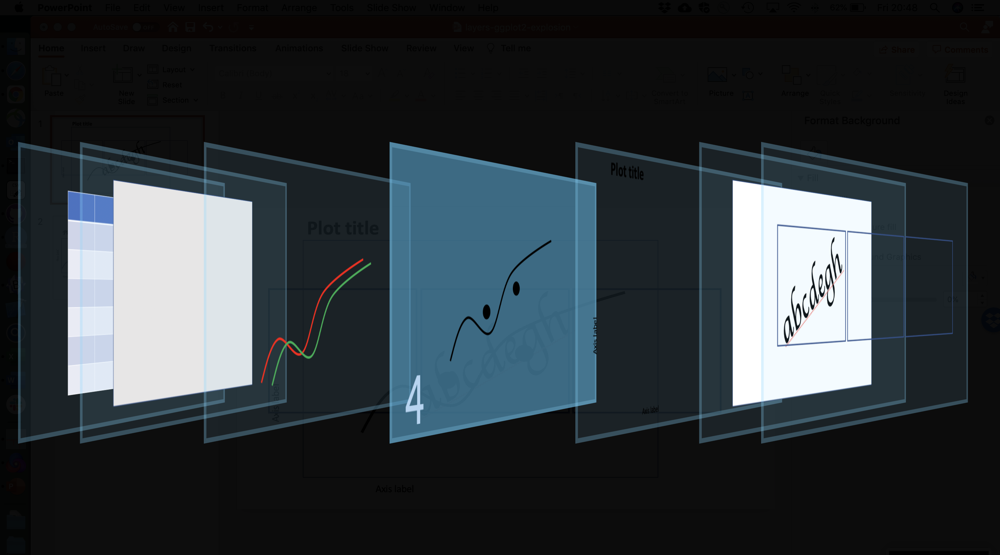
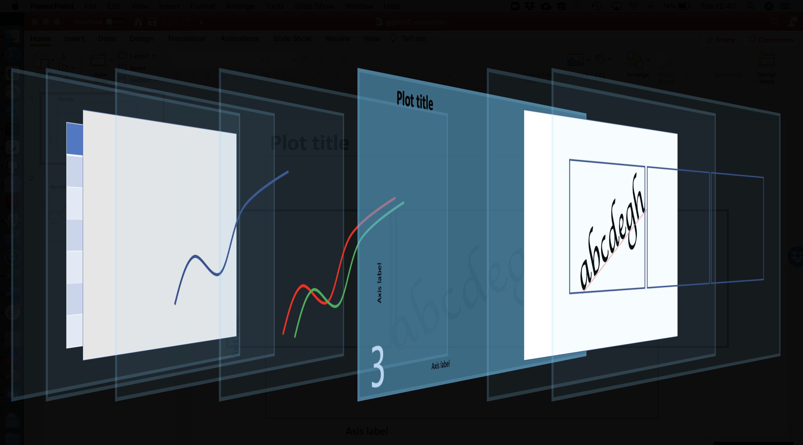
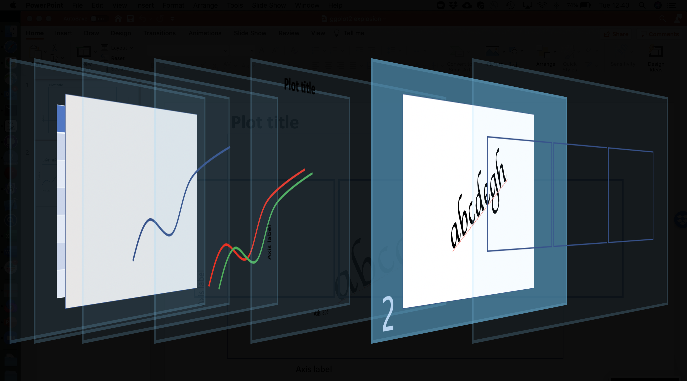
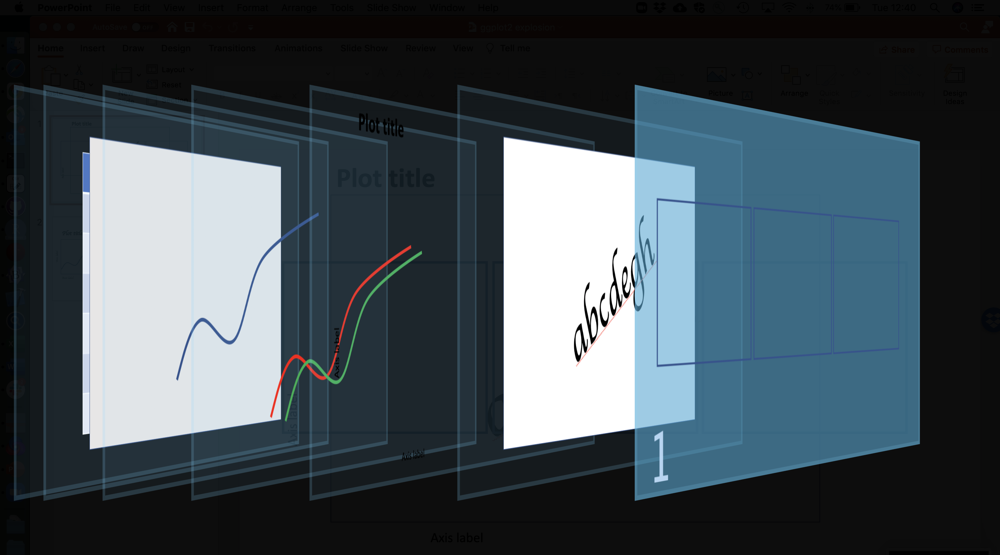
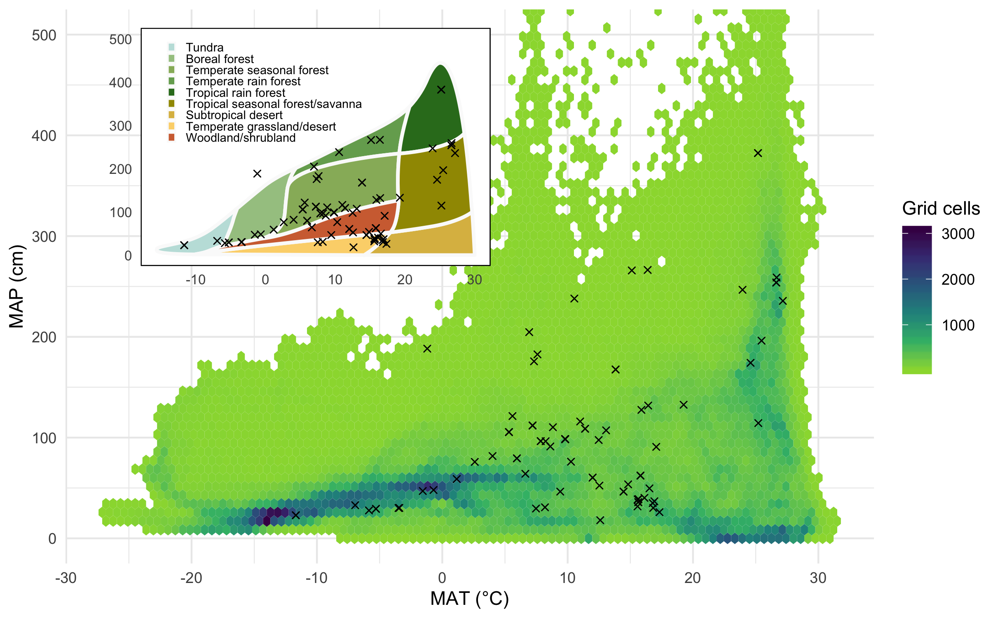

```{r setup, include=FALSE}
knitr::opts_chunk$set(echo = TRUE)
```

<span style="color: red;">**TO DO LIST:**</span>

* Data visualization section - general principles
* Grammar of graphics
* The ggplot2 package
* The dataset - brief
* The ggplot call - finish
* Need to show examples of geoms that compute something (e.g. boxplot, density)
* Labels - finish
* Facets
* Accessibility
* Review and practice central aesthetics, geoms, smoother sections


## Topics {data-background=#cceeff}

* Data visualization concepts
* A grammar of graphics
* An introduction to ggplot2
* The pieces of a ggplot2 plot
* Implications for data structure
* Data, aesthetics, geoms, labels, themes, facets
* Accessibility
* Saving plots
* Fancier things
* Resources

**Goal: to be comfortable making basic reproducible documents.**


## Assumptions

<span style="color: red;">**We assume you're familiar with the basic mechanics of R:**</span>

* Starting R/RStudio
* Scripts, variables, and data frames

So _not_ at this level :)


**This is intended to be a hands-on workshop**, so we also assume:

* You have R (and probably RStudio) installed
* You have the [ggplot2](https://cran.r-project.org/web/packages/ggplot2/index.html) package installed


# Data visualization

- Visualizing data is critical! 
    example from https://towardsdatascience.com/a-comprehensive-guide-to-the-grammar-of-graphics-for-effective-visualization-of-multi-dimensional-1f92b4ed4149
   
General concepts of effective data visualization

- Who is audience, what are you trying to communicate, etc.

- Importance of accessibility

## R plotting pre-ggplot2

One of the simplest datasets included with R is `cars`:

```{r plot-cars, warning=FALSE}
cars
plot(cars)
```

That seems pretty good! What's the problem?

Well, what about `iris`? This is a [famous](https://rpubs.com/AjinkyaUC/Iris_DataSet) dataset:

```{r show-iris, warning=FALSE}
iris
```


Let's plot two of its columns against each other, coloring by species:

```{r plot-iris-base}
plot(iris$Sepal.Length, iris$Sepal.Width, col = iris$Species)
legend(7, 4.3, 
       unique(iris$Species),
       col=1:length(iris$Species), 
       pch = 1)
```

This is a bunch of code for such a simple plot; note that:

* The `plot` code understands numeric vectors, so we need to repeatedly specify `iris$<column>`
* This means the default axis labels are ugly (though they can be changed)
* The legend is _totally disconnected_ from the plot: we have to do everything (color
assignment, etc.) manually

Things quickly gets worse if we want more complexity or features.


# A grammar of graphics

- Origin

- Idea of mapping aesthetics

>To be precise, the layered grammar defines the components of a plot as:
>
>* a default dataset and set of mappings from variables to aesthetics,
>* one or more layers, with each layer having one geometric object, one statistical transformation, one position adjustment, and optionally, one dataset and set of aesthetic mappings,
>* one scale for each aesthetic mapping used,
>* a coordinate system,
>* the facet specification.

From Hadley's book https://vita.had.co.nz/papers/layered-grammar.pdf

# The `ggplot2` package


# Steps to a ggplot2 plot

We have a plot we want to make:


In the grammar of graphics / ggplot2 system, plots are built up from sequential
layers: these are procedural steps, but also literal visual _layers_, 
the net result of which is the final plot. Later steps can modify and
override what's 'presented' by previous layers.

Visually:


We're going to walk through these layers, one by one.

## The dataset


The first (or in back-to-front numbering, as in the image above,
the seventh) step involves our data.

- Implications for how we structure our data (long versus wide)

## The ggplot call


Let's call `ggplot()` using the iris dataset!

```{r ggplot-call, warning=FALSE}
library(ggplot2)
ggplot(iris)
```

Well, that was disappointing.

Remember how easy `plot(cars)` was above...why didn't anything happen here? Well, ggplot doesn't know how to map our plot _aesthetics_ to our _data_, and it doesn't know what _geom_ to use for subsequent visualization.

## Aesthetics mapping


The aesthetics mapping

## Interlude: data structure

This idea of mapping aesthetics to variables has implications for our data structure.

Remember what `iris` looks like:

```{r show-iris-again, warning=FALSE, echo=FALSE}
iris
```

This is problematic. What if we wanted an aesthetic like `color` to depend on what dimension or organ we're measuring?

### Long (tidy) data

With all this in mind, it's clear we need to _reshape_ our data.

```{r}
iris_long <- reshape(iris, 
                     varying = c("Sepal.Length", 
                                 "Sepal.Width",
                                 "Petal.Length",
                                 "Petal.Width"), 
                     timevar = "dimension",
                     direction = "long")
iris_long
```

With this reshaping, we can map an _aesthetic_ to a _column_.

**QUESTION.** Which columns are likely candidates for aesthetics? Why? 

```{r}
iris_plot <- ggplot(iris_long, aes(x = Sepal, 
                                   y = Petal, 
                                   color = Species))
```

## Geoms



### _Now_ we can plot iris! {.tabset}

Compare the ggplot2 code to the base R code we saw earlier:

#### ggplot2

```{r iris-plot-ggplot}
ggplot(iris) + 
  aes(Sepal.Length, Sepal.Width, color = Species) + 
  geom_point()
```

#### base R

```{r iris-plot-base2}
plot(iris$Sepal.Length, iris$Sepal.Width, col = iris$Species)
legend(7, 4.3, 
       unique(iris$Species),
       col=1:length(iris$Species), 
       pch = 1)
```

### {-}

Now the advantages of ggplot2 and the grammar-of-graphics approach start to get very clear.

### Same data, different geoms {.tabset}

Geoms have different aesthetic requirements, and not every geom works with every dataset (visually or computationally): 

#### geom_point

```{r iris-plot-point}
iris_plot + geom_point()
```

#### geom_line

```{r iris-plot-line}
iris_plot + geom_line()
```

#### geom_bin2d

```{r iris-plot-bin2d}
iris_plot + geom_bin2d()
```

#### geom_hex

```{r iris-plot-hex}
iris_plot + geom_area()
```

#### geom_violin

```{r iris-plot-violin}
iris_plot + geom_violin()
```

#### geom_dotplot

```{r iris-plot-dotplot, error=TRUE}
iris_plot + geom_dotplot()
```


### Using multiple geoms

You can have as many geoms in a plot as you want. Later geoms are drawn
in front of earlier ones:

```{r two-geoms}
iris_plot + geom_density_2d() + geom_point()
```

### Geoms and aesthetics

Because of the _layering principle_ we discussed above, later steps and in
particular geoms override earlier ones as the plot is built up.

In particular, if you define aesthetics in geoms they override any earlier definitions _but only within that geom_:

```{r two-geoms-aesthetics}
iris_plot + geom_density_2d() + geom_point(aes(color = dimension))
```

This doesn't make much sense, but this might:

```{r two-geoms-aesthetics2}
iris_plot + 
  geom_density_2d(aes(linetype = dimension)) + 
  geom_point(aes(shape = dimension))
```

**What aesthetics are operative in this plot?**

* At the _plot level_, `x = Sepal`, `y = Petal`, and `color = Species`
* The plot aesthetics hold for `geom_point` but it _also_ uses `shape = dimension`
* The plot aesthetics hold for `geom_density2d` but it _also_ uses `linetype = dimension`

### Geoms that compute things {.tabset}

Some geoms don't take both `x` and `y` aesthetics; rather, they take just one and compute the other, or they transform one of the aesthetics by some computation. _How_ this happens is beyond our scope here (come back next week!) but let's look at a couple of examples.

#### geom_histogram

```{r geom_compute1}
ggplot(iris_long) +
  aes(x = Sepal) +
  geom_histogram()
```

#### geom_boxplot

```{r geom_compute2}
ggplot(iris_long) +
  aes(x = Species, y = Sepal) +
  geom_boxplot()
```

#### geom_boxplot (2)

```{r geom_compute3}
ggplot(iris_long) +
  aes(x = Species, y = Sepal) +
  geom_boxplot() +
  geom_jitter(alpha = 0.5, aes(color = dimension))
```

Notice how the final boxplot-and-point plot makes it clear that the
boxplot-only plot **is highly deceptive**: there are two groups of data here
(two dimensions that were measured), and you probably wouldn't want to present
them combined together.


### Data-less geoms

Some geoms are handy for annotation or to help with interpretation:

```{r two-geoms-ablines}
iris_plot + 
  geom_density_2d(aes(linetype = dimension)) + 
  geom_point(aes(shape = dimension)) +
  # vertical line
  geom_vline(xintercept = 5, size = 3) +
  # horizontal line
  geom_hline(yintercept = 6, color = "purple", linetype = 2) +
  # a-b line
  geom_abline(size = 10, alpha = 0.25, slope = 0.3, intercept = 1)
```

There's also a useful `annotate()` function; see its documentation.

### What geom should I use?


## Smoothers and models

This is really an extension of the section on geoms above. Let's go back
to our basic `iris` plot:

```{r iris-smooth0}
iris_plot + geom_point()
```

We frequently would like to fit, or show, trend lines with point data. The
easiest way to do this is with `geom_smooth()`:

```{r iris-smooth1}
iris_plot + geom_point() + geom_smooth()
```

What's happened here?

* By default, `geom_smooth` uses a [loess smoother](http://r-statistics.co/Loess-Regression-With-R.html),
which is just a form
of [local regression](https://en.wikipedia.org/wiki/Local_regression)
* This is noted in the diagnostic message printed by `geom_smooth` 
* `geom_smooth` inherited the plot aesthetics (x, y, color), so it fit separately to each color (group of data)

More likely, we would like a simple linear regression---i.e., trend lines. We just need to override the default and tell is to use R's [lm](https://www.rdocumentation.org/packages/stats/versions/3.6.2/topics/lm) function:

```{r iris-smooth2, message=FALSE}
iris_plot + geom_point() + geom_smooth(method = "lm")
```

We might also want to fit an _overall_ trend line, to the pooled data (i.e.,
without groups). You might be tempted in this case to override the
color aesthetic to a constant value This works, but it's not ideal. Better:

```{r iris-smooth3, message=FALSE}
iris_plot + geom_point() + 
  geom_smooth(method = "lm") +   # per-group trend line
  geom_smooth(method = "lm",  
              color = "black", 
              group = 1,         # pooled; intent is clear
              linetype = 2)       
```

Behind the scenes:

* Our `color` aesthetic controls the `group` aesthetic in this plot
* `group` is ultimately what determines how the data are split up for computation and plotting
* Setting `group = 1` makes it crystal clear what we want:
a single `group` for the second `geom_smooth`.

Finally, we can use any smoothing function we want, including custom ones.

```{r iris-smooth4, message=FALSE}
ggplot(iris_long, aes(Sepal, Petal)) + 
  geom_point() +
  geom_smooth(method = "lm") +
  geom_smooth(method = "lm", formula = y ~ poly(x, 2), color = "red")    
```

## Labels



Labeling your plots well is [important](https://xkcd.com/833/).


As we've seen, ggplot takes its default axis and aesthetic labels from the columns you specify. These are easy to change using the `xlab` and `ylab` functions; the `ggtitle` function is available as well:

```{r iris-labels, message=FALSE}
iris_plot + geom_point() + 
  geom_smooth(method = "lm") +
  xlab("What is a sepal again?") +
  ylab("Petal (cm)") +
  ggtitle("This is starting to look like a real plot!")
```

## Themes



ggplot's theme system is powerful and sometimes confusing. Like
the rest of the ggplot system, it uses the idea of _inheritance_: you can apply themes, or aspects of them, to entire plots, sub-elements, or small details, and changes cascade down.

The simplest step is to apply a theme to an entire plot:

### Theme examples {.tabset}

#### theme_gray

```{r iris-theme1}
iris_plot + geom_point() + theme_gray()
```

#### theme_dark

```{r iris-theme4}
iris_plot + geom_point() + theme_dark()
```

#### theme_minimal

```{r iris-theme5}
iris_plot + geom_point() + theme_minimal()
```

#### theme_cowplot

_Many_ more themes are available in other R packages and online repositories:

```{r iris-theme6, message=FALSE}
library(cowplot)
iris_plot + geom_point() + theme_cowplot()
```

#### theme_economist

_Many_ more themes are available in other R packages and online repositories:

```{r iris-theme7, message=FALSE, warning=FALSE}
library(ggthemes)
iris_plot + geom_point() + theme_economist()
```

### {-}

The theming system is also how we change specific aspects of plots.

### Theme inheritance {.tabset}

Let's say we want to apply some formatting to text in our plot. But, _which_ text?

#### All text

```{r iris-texttheme1}
iris_plot + geom_point() + ggtitle("Iris") +
  theme(text = element_text(size = 20, color = "red")) 
```

#### Axis text

```{r iris-texttheme2}
iris_plot + geom_point() + ggtitle("Iris") +
  theme(axis.text = element_text(size = 20, color = "red")) 
```

#### x axis text

```{r iris-texttheme3}
iris_plot + geom_point() + ggtitle("Iris") +
  theme(axis.text.x = element_text(size = 20, color = "red")) 
```

#### Bottom x axis text

```{r iris-texttheme4}
iris_plot + geom_point() + ggtitle("Iris") +
  theme(axis.text.x.bottom = element_text(size = 20, color = "red")) 
```

#### All titles

```{r iris-texttheme5}
iris_plot + geom_point() + ggtitle("Iris") +
  theme(title = element_text(size = 20, color = "red")) 
```

#### Axis titles

```{r iris-texttheme6}
iris_plot + geom_point() + ggtitle("Iris") +
  theme(axis.title = element_text(size = 20, color = "red")) 
```

### {-}

We can do similar things with any other aspect of the plot: grid lines, legends, backgrounds, etc. From the [help page](https://ggplot2.tidyverse.org/reference/theme.html):

>Theme elements inherit properties from other theme elements hierarchically. For example, `axis.title.x.bottom` inherits from `axis.title.x` which inherits from `axis.title`, which in turn inherits from `text`. **All text elements inherit directly or indirectly from `text`; all lines inherit from `line`, and all rectangular objects inherit from `rect`.** This means that you can modify the appearance of multiple elements by setting a single high-level component.

**Interestingly** (I just realized this in preparing these slides) this seems to be wrong or at least incomplete? I also don't understand why `axis.text` isn't inheriting from `text`.


## Facets



- facet_wrap
- facet_grid


# Accessibility

# A complicated example

This figure is from a [recent paper](https://onlinelibrary.wiley.com/doi/full/10.1111/gcb.15353) we published with many co-authors in GCB:



This seems---and is---complex, but you now have the tools to see what's happening in the code that generates the figure.

```{r, eval=FALSE}
# Whittaker biome plot
library(plotbiomes)
p_inset <- whittaker_base_plot() +
  geom_point(data = cosore_points, 
             aes(x = mat_cosore, y = map_cosore / 10),
             color = "black", shape = 4) +
  coord_cartesian(ylim = c(0, 500)) +
  theme(axis.title = element_blank(),
        axis.text = element_text(size = 8),
        legend.text = element_text(size = 7),
        legend.key.size = unit(0.4, "lines"),
        legend.position = c(0.35, 0.75),
        legend.title = element_blank(),
        panel.grid.major = element_blank(),
        panel.grid.minor = element_blank(),
        panel.background = element_rect(fill = "white"),
        panel.border = element_rect(colour = "black", 
                                    fill = NA, size = 0.5))

# SP's main climate space plot
p <- ggplot() +
  geom_hex(data = map_mat_global,
           aes(x = mat, y = map / 10), 
           bins = 100, na.rm = TRUE) +
  scale_fill_viridis_c(name = "Grid cells", begin = 0.85, end = 0) +
  geom_point(data = cosore_points, 
             aes(x = mat_cosore, y = map_cosore / 10),
             color = "black", shape = 4, size = 1.5, na.rm = TRUE) +
  theme_minimal() +
  coord_cartesian(ylim = c(0, 500)) +
  labs(x = "MAT (°C)", y = "MAP (cm)")

# Inset the first inside the second
library(cowplot, quietly = TRUE)
ggdraw() +
  draw_plot(p) +
  draw_plot(p_inset, x = 0.1, y = 0.52, width = 0.4, height = 0.45)
```

# Fancier things

Things we haven't talked about (with links)

- Statistical transformations
- Coordinate system changes
- Details about the theme system
- Annotations
- Animations
- Swapping in new data to an existing plot 
- Combining different plots in a larger figure

Some of these are built into `ggplot2`; but there's also a whole
ecosystem of extension packages that people have written.

# Resources

- Cheat sheets
- The ggplot2 online help: https://ggplot2.tidyverse.org/reference/
- The book
- Link to these slides
- Link to repository
- The Intermediate ggplot workshop slides (link)
