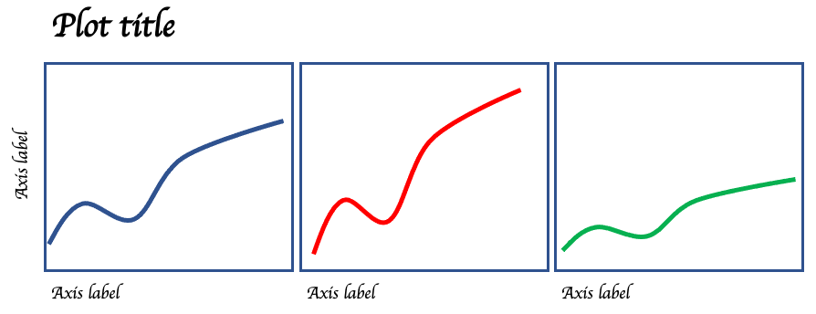
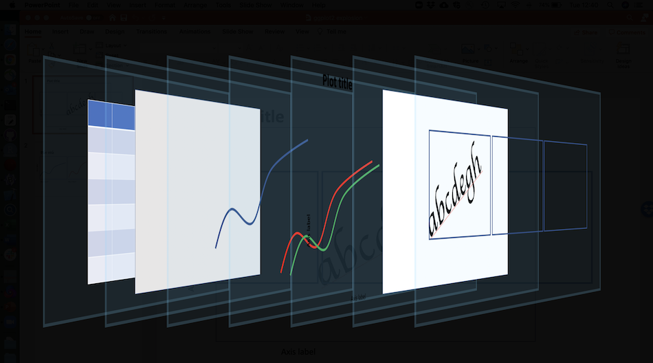
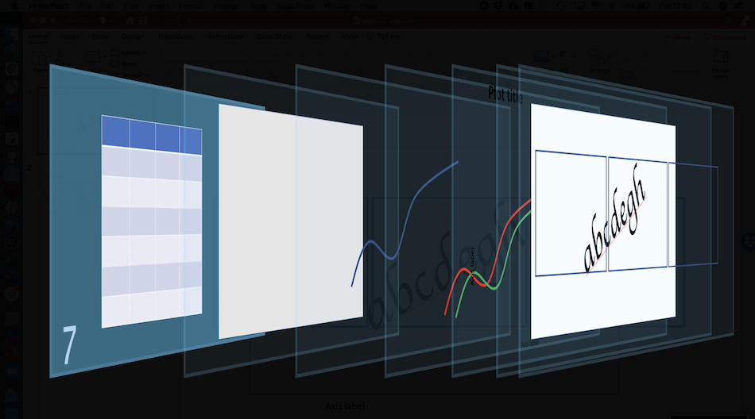
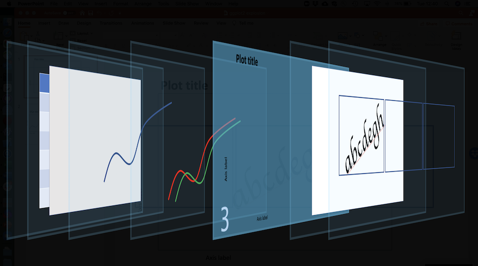

```{r setup, include=FALSE}
knitr::opts_chunk$set(echo = TRUE)
```


# Data visualization - general intro and concepts

- Visualizing data is critical! 
    example from https://towardsdatascience.com/a-comprehensive-guide-to-the-grammar-of-graphics-for-effective-visualization-of-multi-dimensional-1f92b4ed4149
   
General concepts of effective data visualization

- Who is audience, what are you trying to communicate, etc.

- Accessibility


# A grammar of graphics

- Origin

- Idea of mapping aesthetics

>To be precise, the layered grammar defines the components of a plot as:
>
>* a default dataset and set of mappings from variables to aesthetics,
>* one or more layers, with each layer having one geometric object, one statistical transformation, one position adjustment, and optionally, one dataset and set of aesthetic mappings,
>* one scale for each aesthetic mapping used,
>* a coordinate system,
>* the facet specification.

From Hadley's book https://vita.had.co.nz/papers/layered-grammar.pdf

# Data visualization in R pre-ggplot2

- Brief example of using base R's `plot()`

# The pieces of a ggplot2 visualization





## Setup: the dataset



- Implications for how we structure our data (long versus wide)

## The ggplot call


## The geom(s)


- Spend time here. Demonstrate different geoms applied to same data
- If you define aesthetics in geoms they _override_ the base plot aesthetics

## The aesthetics mapping


## The labels



- ggplot makes default labels from columns
- xlab, ylab, ggtitle

## The themes


- can apply many pre-made themes
- examples
- more available online, e.g. xkcd theme

## The facets


- facet_wrap
- facet_grid


## Things we haven't talked about (with links)

- Statistical transformations
- Coordinate system changes
- Details about the theme system
- Annotations
- Plotting different datasets in a single plot
- Combining different plots in a larger figure

## Resources

- Cheat sheets
- The book
- Link to these slides
- Link to repository
