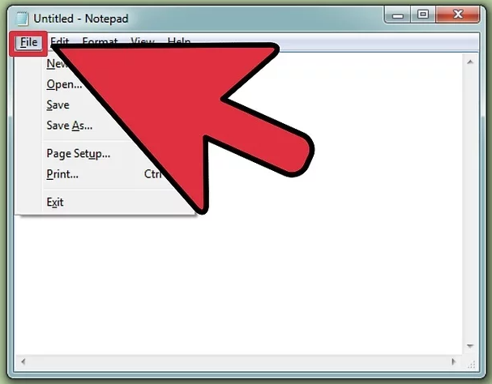
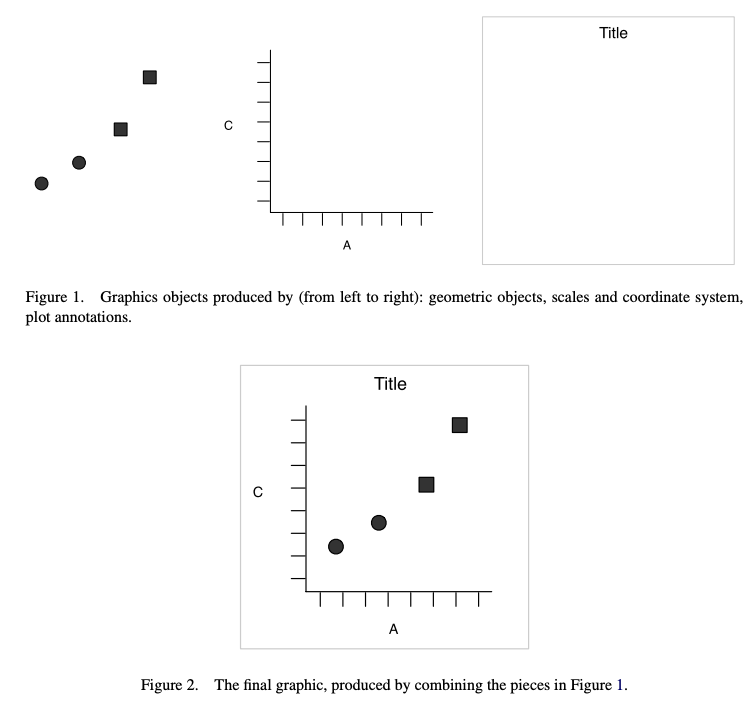
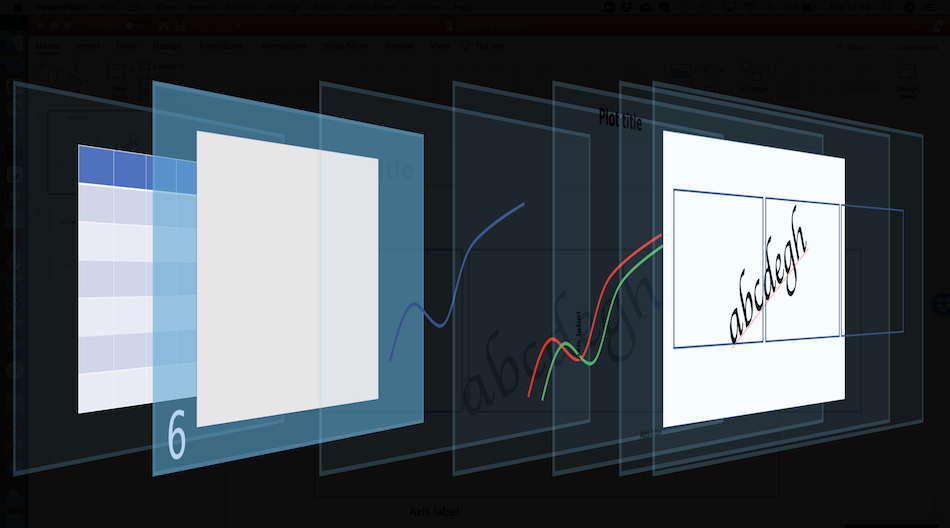

```{r setup, include=FALSE}
knitr::opts_chunk$set(echo = TRUE)
```

<span style="color: red;">**TO DO LIST:**</span>

* Data visualization section - general principles
* Grammar of graphics
* The ggplot2 package
* The dataset - brief
* The ggplot call - finish
* Facets
* Review and practice central aesthetics, geoms, smoother sections
* Make feedback google form

# Topics

* Data visualization concepts
* A grammar of graphics
* An introduction to ggplot2
* The pieces of a ggplot2 plot
* Implications for data structure
* Data, aesthetics, geoms, labels, themes, facets
* Accessibility
* Saving plots
* Fancier things
* Resources

**Goal: understand the principles that ggplot is built on, and the steps needed to create a wide variety of basic plots.**


# Assumptions

<span style="color: red;">**We assume you're familiar with the basic mechanics of R:**</span>

* Starting R/RStudio
* Scripts, variables, and data frames

So _not_ at this level :)



**This is intended to be a hands-on workshop**, so we also assume:

* You have R (and probably RStudio) installed
* You have the [ggplot2](https://cran.r-project.org/web/packages/ggplot2/index.html) package installed


# Data visualization

- Visualizing data is critical! 
    example from https://towardsdatascience.com/a-comprehensive-guide-to-the-grammar-of-graphics-for-effective-visualization-of-multi-dimensional-1f92b4ed4149
   
General concepts of effective data visualization

- Who is audience, what are you trying to communicate, etc.

Data visualization can have [consequences](https://xkcd.com/523/)!


- Importance of accessibility

## Plotting in base R

One of the simplest datasets included with R is `cars`:

```{r plot-cars, warning=FALSE}
cars
plot(cars)
```

That seems pretty good! What's the problem?

Well, what about `iris`? This is a [famous](https://rpubs.com/AjinkyaUC/Iris_DataSet) dataset; from the help (`?iris`):

>This famous (Fisher's or Anderson's) iris data set gives the measurements in centimeters of the variables sepal length and width and petal length and width, respectively, for 50 flowers from each of 3 species of iris. The species are _Iris setosa_, _versicolor_, and _virginica_.


```{r show-iris, warning=FALSE}
iris
```

**Note that each row of `iris` is an _individual flower_; there are four observations per row.** We'll come back to this structural point later.

Let's plot two of its columns against each other, coloring by species:

```{r plot-iris-base}
plot(iris$Sepal.Length, iris$Sepal.Width, col = iris$Species)
legend(7, 4.3, 
       unique(iris$Species),
       col = 1:length(iris$Species), 
       pch = 1)
```

This is a bunch of code for such a simple plot; note that:

* The `plot` code understands numeric vectors, so we need to repeatedly specify `iris$<column>`
* This means the default axis labels are ugly (though they can be changed)
* The legend is _totally disconnected_ from the plot: we have to do everything (color
assignment, etc.) manually

Things quickly gets worse if we want more complexity or features. What's the underlying pproblem?

>Without a grammar, there is no underlying theory, so most graphics packages are just a big collection of special cases. 

From the [ggplot2 book](https://ggplot2-book.org/introduction.html).


# A grammar of graphics

Above we made some scatterplots, perhaps the simplest graph type.

>What precisely is a scatterplot? You have seen many before and have probably even drawn some by hand. A scatterplot represents each observation as a point, positioned according to the value of two variables. As well as a horizontal and vertical position, each point also has a size, a colour and a shape. These attributes are called aesthetics, and are the properties that can be perceived on the graphic. Each aesthetic can be mapped to a variable, or set to a constant value.



This insight had been made before Hadley Wickham's [original paper](https://vita.had.co.nz/papers/layered-grammar.pdf), but in the context of R it laid the ground for ggplot2:

>To be precise, the layered grammar defines the components of a plot as:
>
>* a default dataset and set of mappings from variables to aesthetics,
>* one or more layers, with each layer having one geometric object, one statistical transformation, one position adjustment, and optionally, one dataset and set of aesthetic mappings,
>* one scale for each aesthetic mapping used,
>* a coordinate system,
>* the facet specification.

We are learning about (a subset of) these steps today.


# Steps to a ggplot2 plot

Say we have a plot we want to make, a slightly more complicated version of Wickham (2010 Figure 2 above:


In the grammar of graphics / ggplot2 system, plots are built up from sequential
layers: these are procedural steps, but also literal visual _layers_, 
the net result of which is the final plot. Later steps can modify and
override what's 'presented' by previous layers.

Visually:


We're going to walk through these layers, one by one.

## The dataset


The first (or in back-to-front numbering, as in the image above,
the seventh) step involves our data.

As noted above, the _structure_ of our data has implications for how we plot it; more precisely, to effectively use ggplot2 we want our data to be structured a certain way. But again `r `library(emo); emo::ji("smile")` let's come back to that point.

Generally, our data for plotting should be in **tabular** format, with rows and named columns. In R this is typically a `data.frame` or a `tibble`.


## The ggplot call



Hey, `iris` is a data frame. Let's call `ggplot()` on it!

```{r ggplot-call, warning=FALSE}
library(ggplot2)
ggplot(iris)
```

Well, that was disappointing.

Remember how easy `plot(cars)` was above...why didn't anything happen here? Well, `ggplot()` doesn't know how to map our plot _aesthetics_ to our _data_, and it doesn't know what _geom_ to use for subsequent visualization.

## Aesthetics mapping


The aesthetics mapping

TODO TODO TODO

## Interlude: data structure

This idea of mapping aesthetics to variables has implications for our data structure.

Remember what `iris` looks like:

```{r show-iris-again, warning=FALSE, echo=FALSE}
iris
```

This is problematic. What if we wanted an aesthetic like `color` to depend on what dimension or organ we're measuring?

### Long (tidy) data

With all this in mind, it's clear we need to _reshape_ our data.

```{r}
iris_long <- reshape(iris, 
                     varying = c("Sepal.Length", 
                                 "Sepal.Width",
                                 "Petal.Length",
                                 "Petal.Width"), 
                     timevar = "dimension",
                     direction = "long")
iris_long
```

With this reshaping, we can map an _aesthetic_ to a _column_.

**QUESTION.** Which columns are likely candidates for aesthetics? Why? 

## Geoms


### _Now_ we can plot iris! {.tabset}

Compare the ggplot2 code to the base R code we saw earlier:

#### ggplot2

```{r iris-plot-ggplot}
ggplot(iris) + 
  aes(Sepal.Length, Sepal.Width, color = Species) + 
  geom_point()
```

#### base R

```{r iris-plot-base2}
plot(iris$Sepal.Length, iris$Sepal.Width, col = iris$Species)
legend(7, 4.3, 
       unique(iris$Species),
       col=1:length(iris$Species), 
       pch = 1)
```

### {-}

Now the advantages of ggplot2 and the grammar-of-graphics approach start to get clear.

### Same data, different geoms {.tabset}

Geoms have different aesthetic requirements, and not every geom works with every dataset (visually or computationally): 

```{r}
iris_plot <- ggplot(iris_long, aes(x = Sepal, 
                                   y = Petal, 
                                   color = Species))
```

#### geom_point

```{r iris-plot-point}
iris_plot + geom_point()
```

#### geom_line

```{r iris-plot-line}
iris_plot + geom_line()
```

#### geom_bin2d

```{r iris-plot-bin2d}
iris_plot + geom_bin2d()
```

#### geom_hex

```{r iris-plot-hex}
iris_plot + geom_area()
```

#### geom_violin

```{r iris-plot-violin}
iris_plot + geom_violin()
```

#### geom_dotplot

```{r iris-plot-dotplot, error=TRUE}
iris_plot + geom_dotplot()
```


### Using multiple geoms

You can have as many geoms in a plot as you want. Later geoms are drawn
in front of earlier ones:

```{r two-geoms}
iris_plot + geom_density_2d() + geom_point()
```

### Geoms and aesthetics

Because of the _layering principle_ we discussed above, later steps and in
particular geoms override earlier ones as the plot is built up.

In particular, if you define aesthetics in geoms they override any earlier definitions _but only within that geom_:

```{r two-geoms-aesthetics}
iris_plot + geom_density_2d() + geom_point(aes(color = dimension))
```

This doesn't make much sense, but this might:

```{r two-geoms-aesthetics2}
iris_plot + 
  geom_density_2d(aes(linetype = dimension)) + 
  geom_point(aes(shape = dimension))
```

**What aesthetics are operative in this plot?**

* At the _plot level_, `x = Sepal`, `y = Petal`, and `color = Species`
* The plot aesthetics hold for `geom_point` but it _also_ uses `shape = dimension`
* The plot aesthetics hold for `geom_density2d` but it _also_ uses `linetype = dimension`

### Geoms that compute things {.tabset}

Some geoms don't take both `x` and `y` aesthetics; rather, they take just one and compute the other, or they transform one of the aesthetics by some computation. _How_ this happens is beyond our scope here (come back next week!) but let's look at a couple of examples.

#### geom_histogram

```{r geom_compute1}
ggplot(iris_long) +
  aes(x = Sepal) +
  geom_histogram()
```

#### geom_boxplot

```{r geom_compute2}
ggplot(iris_long) +
  aes(x = Species, y = Sepal) +
  geom_boxplot()
```

#### geom_boxplot (2)

```{r geom_compute3}
ggplot(iris_long) +
  aes(x = Species, y = Sepal) +
  geom_boxplot() +
  geom_jitter(alpha = 0.5, aes(color = dimension))
```

Notice how the final boxplot-and-point plot makes it clear that the
boxplot-only plot **is highly deceptive**: there are two groups of data here
(two dimensions that were measured), and you probably wouldn't want to present
them combined together.


### Data-less geoms

Some geoms are handy for annotation or to help with interpretation:

```{r two-geoms-ablines}
iris_plot + 
  geom_density_2d(aes(linetype = dimension)) + 
  geom_point(aes(shape = dimension)) +
  # vertical line
  geom_vline(xintercept = 5, size = 3) +
  # horizontal line
  geom_hline(yintercept = 6, color = "purple", linetype = 2) +
  # a-b line
  geom_abline(size = 10, alpha = 0.25, slope = 0.3, intercept = 1)
```

There's also a useful `annotate()` function; see its documentation.

### What geom should I use?

TODO TODO TODO

## Smoothers and models

This is really an extension of the section on geoms above. Let's go back
to our basic `iris` plot:

```{r iris-smooth0}
iris_plot + geom_point()
```

We frequently would like to fit, or show, trend lines with point data. The
easiest way to do this is with `geom_smooth()`:

```{r iris-smooth1}
iris_plot + geom_point() + geom_smooth()
```

What's happened here?

* By default, `geom_smooth` uses a [loess smoother](http://r-statistics.co/Loess-Regression-With-R.html),
which is just a form
of [local regression](https://en.wikipedia.org/wiki/Local_regression)
* This is noted in the diagnostic message printed by `geom_smooth` 
* `geom_smooth` inherited the plot aesthetics (x, y, color), so it fit separately to each color (group of data)

More likely, we would like a simple linear regression---i.e., trend lines. For this we just need to override the default and tell is to use R's [lm](https://www.rdocumentation.org/packages/stats/versions/3.6.2/topics/lm) function:

```{r iris-smooth2, message=FALSE}
iris_plot + geom_point() + geom_smooth(method = "lm")
```

We might also want to fit an _overall_ trend line, to the pooled data (i.e.,
without groups). You might be tempted in this case to override the
color aesthetic to a constant value. This works, but it's not ideal. Better:

```{r iris-smooth3, message=FALSE}
iris_plot + geom_point() + 
  geom_smooth(method = "lm") +   # per-group trend line
  geom_smooth(method = "lm",  
              color = "black", 
              group = 1,         # pooled; intent is clear
              linetype = 2)       
```

Behind the scenes:

* Our `color` aesthetic controls the `group` aesthetic in this plot
* `group` is ultimately what determines how the data are split up for computation and plotting
* Setting `group = 1` makes it crystal clear what we want:
a single `group` for the second `geom_smooth`.

Finally, we can use any smoothing function we want, including custom ones.

```{r iris-smooth4, message=FALSE}
ggplot(iris_long, aes(Sepal, Petal)) + 
  geom_point() +
  geom_smooth(method = "lm") +
  geom_smooth(method = "lm", formula = y ~ poly(x, 2), color = "red")    
```

## Labels


Labeling your plots well is [important](https://xkcd.com/833/).


As we've seen, ggplot2 takes its default axis and aesthetic labels from the columns you specify. These are easy to change using the `xlab` and `ylab` functions; the `ggtitle` function is available as well:

```{r iris-labels, message=FALSE}
iris_plot + geom_point() + 
  geom_smooth(method = "lm") +
  xlab("What is a sepal again?") +
  ylab("Petal (cm)") +
  ggtitle("This is starting to look like a real plot!")
```

## Themes


ggplot2's theme system is powerful and sometimes confusing. Like
the rest of the ggplot system, it uses the idea of _inheritance_: you can apply themes, or aspects of them, to entire plots, sub-elements, or small details, and changes cascade down.

The simplest step is to apply a theme to an entire plot:

### Theme examples {.tabset}

#### theme_gray

```{r iris-theme1}
iris_plot + geom_point() + theme_gray()
```

#### theme_dark

```{r iris-theme4}
iris_plot + geom_point() + theme_dark()
```

#### theme_minimal

```{r iris-theme5}
iris_plot + geom_point() + theme_minimal()
```

#### theme_cowplot

_Many_ more themes are available in other R packages and online repositories:

```{r iris-theme6, message=FALSE}
library(cowplot)
iris_plot + geom_point() + theme_cowplot()
```

#### theme_economist

_Many_ more themes are available in other R packages and online repositories:

```{r iris-theme7, message=FALSE, warning=FALSE}
library(ggthemes)
iris_plot + geom_point() + theme_economist()
```

### {-}

The theming system is also how we change specific aspects of plots.

### Theme inheritance {.tabset}

Let's say we want to apply some formatting to text in our plot. But, _which_ text?

#### All text

```{r iris-texttheme1}
iris_plot + geom_point() + ggtitle("Iris") +
  theme(text = element_text(size = 20, color = "red")) 
```

#### Axis text

```{r iris-texttheme2}
iris_plot + geom_point() + ggtitle("Iris") +
  theme(axis.text = element_text(size = 20, color = "red")) 
```

#### x axis text

```{r iris-texttheme3}
iris_plot + geom_point() + ggtitle("Iris") +
  theme(axis.text.x = element_text(size = 20, color = "red")) 
```

#### Bottom x axis text

```{r iris-texttheme4}
iris_plot + geom_point() + ggtitle("Iris") +
  theme(axis.text.x.bottom = element_text(size = 20, color = "red")) 
```

#### All titles

```{r iris-texttheme5}
iris_plot + geom_point() + ggtitle("Iris") +
  theme(title = element_text(size = 20, color = "red")) 
```

#### Axis titles

```{r iris-texttheme6}
iris_plot + geom_point() + ggtitle("Iris") +
  theme(axis.title = element_text(size = 20, color = "red")) 
```

### {-}

We can do similar things with any other aspect of the plot: grid lines, legends, backgrounds, etc. From the [help page](https://ggplot2.tidyverse.org/reference/theme.html):

>Theme elements inherit properties from other theme elements hierarchically. For example, `axis.title.x.bottom` inherits from `axis.title.x` which inherits from `axis.title`, which in turn inherits from `text`. **All text elements inherit directly or indirectly from `text`; all lines inherit from `line`, and all rectangular objects inherit from `rect`.** This means that you can modify the appearance of multiple elements by setting a single high-level component.

**Interestingly** (I just realized this in preparing these slides) this seems to be wrong or at least incomplete? I don't understand why `axis.text` isn't inheriting from `text` (which is what the documentation says). `r emo::ji("shrug")`


## Facets


- facet_wrap
- facet_grid


# Accessibility {.tabset}

At a minimum, be aware that some of the default colors in ggplot2 have equal [luminance](http://www.workwithcolor.com/color-luminance-2233.htm) and so can be difficult to distinguish, particularly for colorblind viewers.

We can change colors and palettes, however; for example, the [Viridis](https://www.thinkingondata.com/something-about-viridis-library/) color scales included with ggplot2 are designed to be perceptually uniform in both color and black-and-white. They are also designed to be perceived by viewers with common forms of color blindness.

Use `viridsd()` with discrete data...

```{r, txhousing0, echo=FALSE}
txsamp <- subset(txhousing, city %in%
                   c("Houston", "Fort Worth", "San Antonio", "Dallas", "Austin"))
tx_housing <- ggplot(data = txsamp, aes(x = sales, y = median)) + 
  geom_point(aes(colour = city))
```

## Default

```{r txhousing1}
tx_housing  # down-sampled from the "txhousing" dataset
```

## scale_colour_viridis_d

```{r txhousing2}
tx_housing + scale_color_viridis_d()
```

# {-}

...and `viridisc()` with continuous data.

The [RColorBrewer](https://cran.r-project.org/web/packages/RColorBrewer/RColorBrewer.pdf) package is another good option worth looking into.


# Using and saving plots

Note that `ggplot()` objects are just like any other R object, and can be printed (displaying the plot), passed to functions, saved to disk, etc.

The primary way to save a _plot image_ is the `ggsave()` function:

```{r, eval=FALSE}
p <- ggplot(cars, aes(speed, dist)) + geom_point()
print(p)
ggsave("cars_plot.pdf")

# You can specify file types and dimensions:
q <- ggplot(iris, aes(Sepal.Length)) + geom_histogram()
print(q)
ggsave("iris_plot.png", width = 8, height = 5)

# By default ggsave assumes you mean "save the last plot generated"
# but you can save arbitrary objects:
ggsave("cars_plot.jpg", plot = p + theme_bw())
```


# A complicated example

This figure is from a [recent paper](https://onlinelibrary.wiley.com/doi/full/10.1111/gcb.15353) we published with many co-authors in GCB:


This seems---and is---complex, but you now have the tools to see what's happening in the code that generates the figure.

```{r, eval=FALSE}
# Whittaker biome plot
library(plotbiomes)
p_inset <- whittaker_base_plot() +
  geom_point(data = cosore_points, 
             aes(x = mat_cosore, y = map_cosore / 10),
             color = "black", shape = 4) +
  coord_cartesian(ylim = c(0, 500)) +
  theme(axis.title = element_blank(),
        axis.text = element_text(size = 8),
        legend.text = element_text(size = 7),
        legend.key.size = unit(0.4, "lines"),
        legend.position = c(0.35, 0.75),
        legend.title = element_blank(),
        panel.grid.major = element_blank(),
        panel.grid.minor = element_blank(),
        panel.background = element_rect(fill = "white"),
        panel.border = element_rect(colour = "black", 
                                    fill = NA, size = 0.5))

# SP's main climate space plot
p <- ggplot() +
  geom_hex(data = map_mat_global,
           aes(x = mat, y = map / 10), 
           bins = 100, na.rm = TRUE) +
  scale_fill_viridis_c(name = "Grid cells", begin = 0.85, end = 0) +
  geom_point(data = cosore_points, 
             aes(x = mat_cosore, y = map_cosore / 10),
             color = "black", shape = 4, size = 1.5, na.rm = TRUE) +
  theme_minimal() +
  coord_cartesian(ylim = c(0, 500)) +
  labs(x = "MAT (°C)", y = "MAP (cm)")

# Inset the first inside the second
library(cowplot, quietly = TRUE)
ggdraw() +
  draw_plot(p) +
  draw_plot(p_inset, x = 0.1, y = 0.52, width = 0.4, height = 0.45)
```

# Fancier things

This workshop has covered a lot of ground, which it's skipped over and/or fudged
some things for clarity and time.

Important things we haven't talked about include:

- Statistical transformations
- Scales and coordinate systems
- Details about the theme system
- Plotting dates, maps, animations
- Swapping in new data to an existing plot 
- Combining different plots in a larger figure

Some of these are built into ggplot2, but there's also a whole
ecosystem of extension packages that people have written.


# Resources

[This](https://www.cedricscherer.com/2019/05/17/the-evolution-of-a-ggplot-ep.-1/) is a great walkthrough of the evolution of a complex and beautiful visualization:


- RStudio ggplot2 [cheat sheet](https://rstudio.com/wp-content/uploads/2015/03/ggplot2-cheatsheet.pdf)
- The ggplot2 [online help](https://ggplot2.tidyverse.org/reference/)
- The grammar of graphics [paper](https://vita.had.co.nz/papers/layered-grammar.pdf)
- The ggplot2 [book](https://ggplot2-book.org/)
- Link to these slides
- Link to repository
- The Intermediate ggplot workshop slides (link)
