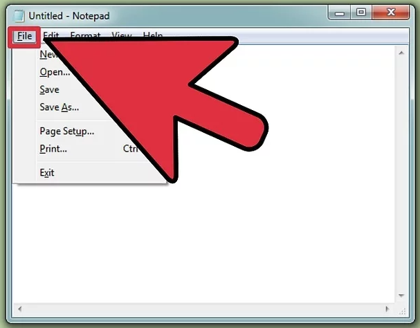
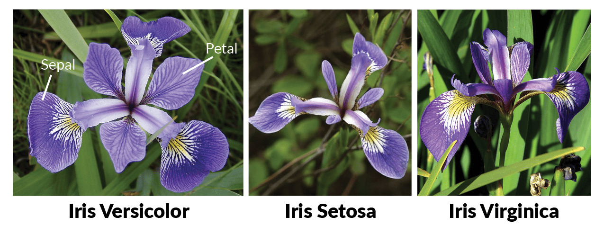
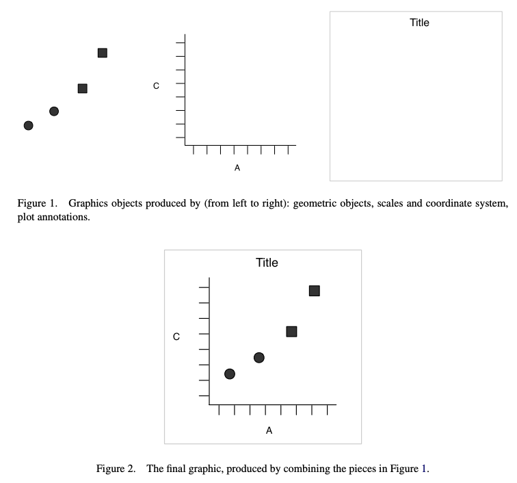
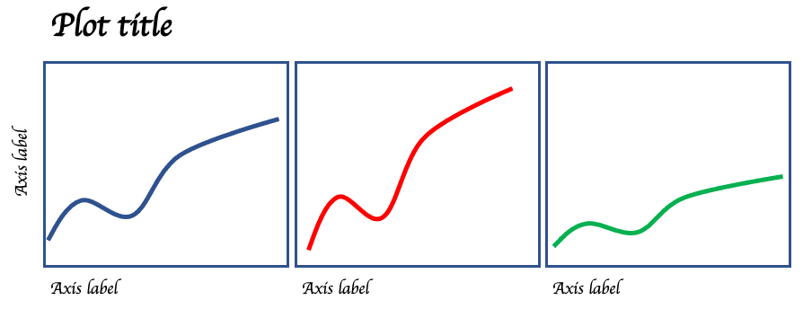
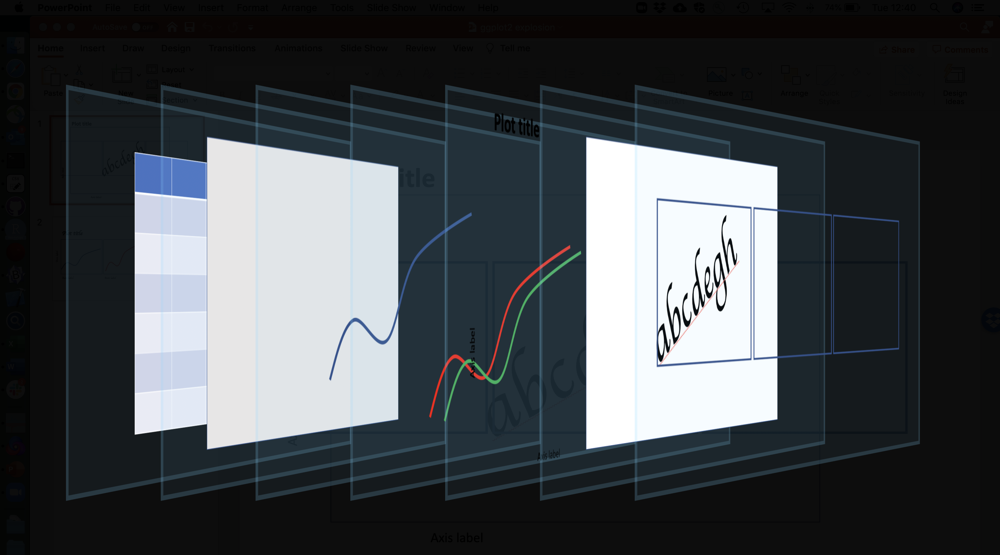
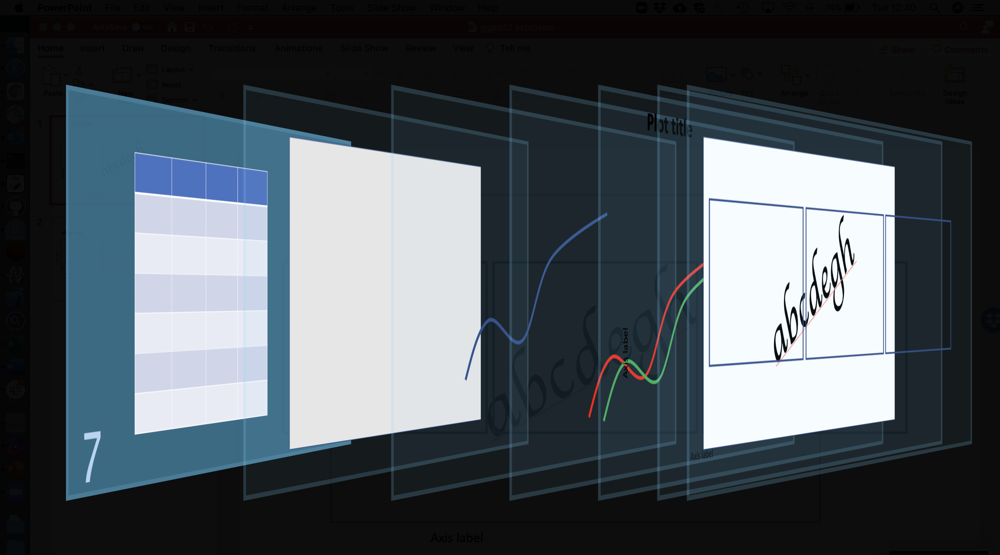
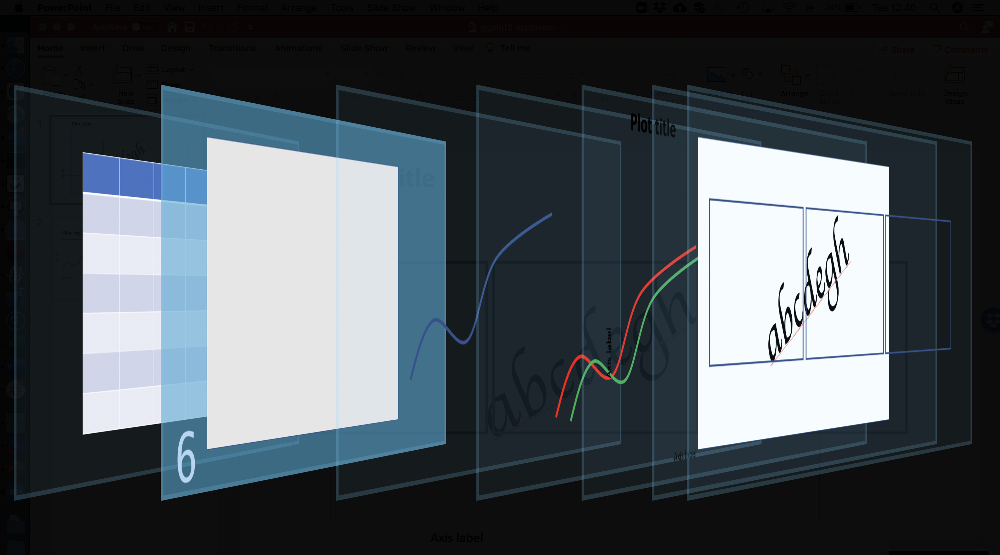
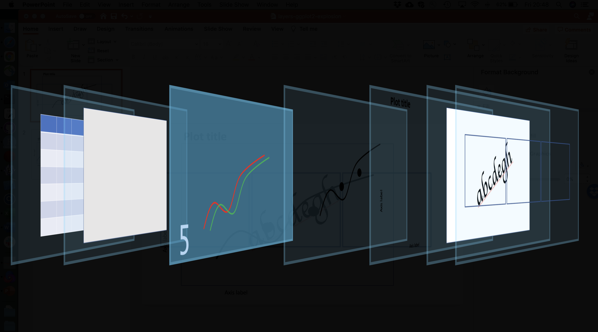

Part 2 is [here](https://rpubs.com/bpbond/727256).

```{r setup, include=FALSE}
knitr::opts_chunk$set(echo = TRUE)
library(emo)  # install via devtools::install_github("hadley/emo")
```

# Topics

* Data visualization concepts
* A grammar of graphics
* An introduction to ggplot2
* The pieces of a ggplot2 plot
* Implications for data structure
* Data, aesthetics, geoms, labels, themes, facets
* Accessibility
* Saving plots
* Fancier things
* Resources

**Goal: understand the principles that ggplot is built on, and the steps needed to create a wide variety of basic plots.**


# Assumptions

<span style="color: red;">**We assume you're familiar with the basic mechanics of R:**</span>

* Starting R/RStudio
* Scripts, variables, and data frames

So _not_ at this level :)



**This is intended to be a hands-on workshop**, so we also assume:

* You have R (and probably RStudio) installed
* You have the [ggplot2](https://cran.r-project.org/web/packages/ggplot2/index.html) package installed


# Data visualization {#dataviz}

Visualizing data is [critical](https://towardsdatascience.com/a-comprehensive-guide-to-the-grammar-of-graphics-for-effective-visualization-of-multi-dimensional-1f92b4ed4149):


**The x and y mean, standard deviation, and x-y correlation are unchanged throughout this animation.**

Another example of this is [Anscombe's Quartet](https://en.wikipedia.org/wiki/Anscombe%27s_quartet):


**All four of _these_ datasets have identical `mean(x)`, `mean(y)`, `var(x)`, `var(y)`, `cor(x, y)`, and regression (intercept, slope, r-squared).**  `r emo::ji("exploding_head")`

Lots of research has been done on effective data visualization with respect to science communication. Read a bit of it. [For example](https://www.sciencedirect.com/science/article/pii/S2666389920301896) here are one author's ten principles of effective data visualization:

* Diagram First: identify the information you want to share
* **Use the Right Software**
* **Use an Effective Geometry and Show Data**
* **Colors _Always_ Mean Something**
* Include Uncertainty
* **Panel, when Possible**
* Data and Models Are Different Things
* Simple Visuals, Detailed Captions
* Consider an Infographic
* Get an Opinion

To these I would only add "know your audience".

Remember, data visualization can have [consequences](https://xkcd.com/523/)!


## Plotting in base R

One of the simplest datasets included with R is `cars`:

```{r plot-cars, warning=FALSE}
cars
plot(cars)
```

That seems pretty good! What's the problem?

Well, what about `iris`? This is a [famous](https://rpubs.com/AjinkyaUC/Iris_DataSet) dataset; from the help (`?iris`):

>This famous (Fisher's or Anderson's) iris data set gives the measurements in centimeters of the variables sepal length and width and petal length and width, respectively, for 50 flowers from each of 3 species of iris. The species are _Iris setosa_, _versicolor_, and _virginica_.



```{r show-iris, warning=FALSE}
iris
```

**Note that each row of `iris` is an _individual flower_; there are four observations per row.** We'll come back to this structural point later.

Let's plot two of its columns against each other, coloring by species:

```{r plot-iris-base}
plot(iris$Sepal.Length, iris$Sepal.Width, col = iris$Species)
legend(7, 4.3, 
       unique(iris$Species),
       col = 1:length(iris$Species), 
       pch = 1)
```

This is a bunch of code for such a simple plot; note that:

* The `plot` code understands numeric vectors, so we need to repeatedly specify `iris$<column>`
* This means the default axis labels are ugly (though they can be changed)
* The legend is _totally disconnected_ from the plot: we have to do everything (color
assignment, etc.) manually

Things quickly gets worse if we want more complexity or features. What's the underlying pproblem?

>Without a grammar, there is no underlying theory, so most graphics packages are just a big collection of special cases. 

From the [ggplot2 book](https://ggplot2-book.org/introduction.html).


# A grammar of graphics

Above we made some scatterplots, perhaps the simplest graph type.

>What precisely is a scatterplot? You have seen many before and have probably even drawn some by hand. A scatterplot represents each observation as a point, positioned according to the value of two variables. As well as a horizontal and vertical position, each point also has a size, a colour and a shape. These attributes are called aesthetics, and are the properties that can be perceived on the graphic. Each aesthetic can be mapped to a variable, or set to a constant value.



This insight had been made before Hadley Wickham's [original paper](https://vita.had.co.nz/papers/layered-grammar.pdf), but in the context of R it laid the ground for ggplot2:

>To be precise, the layered grammar defines the components of a plot as:
>
>* a default dataset and set of mappings from variables to aesthetics,
>* one or more layers, with each layer having one geometric object, one statistical transformation, one position adjustment, and optionally, one dataset and set of aesthetic mappings,
>* one scale for each aesthetic mapping used,
>* a coordinate system,
>* the facet specification.

We are learning about (a subset of) these steps today.


# Steps to a ggplot2 plot

Say we have a plot we want to make, a slightly more complicated version of Wickham (2010) Figure 2 above:



In the grammar of graphics / ggplot2 system, plots are built up from sequential
layers: these are procedural steps, but also literal visual _layers_, 
the net result of which is the final plot. Later steps can modify and
override what's 'presented' by previous layers.

Visually:



We're going to walk through these layers, one by one.

## 7. The dataset



The first (or in back-to-front numbering, as in the image above,
the seventh) step involves our data.

As noted above, the _structure_ of our data has implications for how we plot it; more precisely, to effectively use ggplot2 we want our data to be structured a certain way. But again `r emo::ji("smile")` let's come back to that point.

Generally, our data for plotting should be in **tabular** format, with rows and named columns. In R this is typically a `data.frame` or a `tibble`.


## 6. The ggplot call



Hey, `iris` is a data frame. Let's call `ggplot()` on it!

```{r ggplot-call, warning=FALSE}
library(ggplot2)
ggplot(iris)
```

Well, that was disappointing.

Remember how easy `plot(cars)` was above...why didn't anything happen here? Well, `ggplot()` doesn't know how to map our plot _aesthetics_ to our _data_, and it doesn't know what _geom_ to use for subsequent visualization.


## 5. Aesthetics mapping



As we said above, the _aesthetics_ of each layer in our plot can either be
* constant, or
* mapped to a column of data

Inverting this statement means that
* Any non-constant aesthetic has to be _its own column_ in the data 

This idea of mapping aesthetics to columns thus has implications for our the _structure_ of our data.

## Interlude: data structure

Remember what `iris` looks like:

```{r show-iris-again, warning=FALSE, echo=FALSE}
iris
```

This is problematic. What if we wanted an aesthetic like `color` to depend on what dimension or organ we're measuring?

**`iris` is structured in a form convenient for humans, but not one
particularly handy for computers.**

In general it's best to start with your data in ["tidy" form](https://cran.r-project.org/web/packages/tidyr/vignettes/tidy-data.html), a.k.a. long form,
when preparing to use ggplot2. This means that every row contains exactly **one**
observation; specifically:

* Each _variable_ forms a column.
* Each _observation_ forms a row.
* Each type of observational unit forms a table.

### Long (tidy) data

With all this in mind, it's clear we need to _reshape_ our data. Let's assume,
for the rest of this workshop, that we're particularly interested in comparing
observations of _petals_ versus those of _sepals_:

```{r}
# Here we use base R's "reshape" function
# There are many alternatives; in particular, check out
# the powerful "tidyr" package
iris_long <- reshape(iris, 
                     varying = c("Sepal.Length", 
                                 "Sepal.Width",
                                 "Petal.Length",
                                 "Petal.Width"), 
                     timevar = "dimension",
                     direction = "long")
iris_long
```

**Note that this is _not_ strictly "tidy data", per the definition above. Why not?**

With this reshaping, we can proceed to map _aesthetics_ to _columns_.
