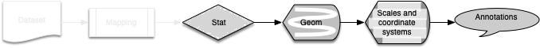
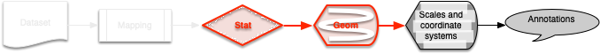
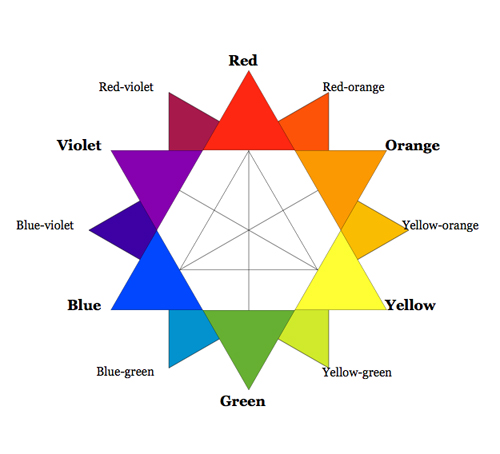
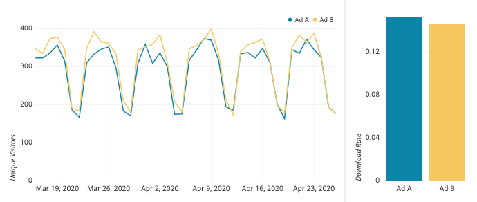
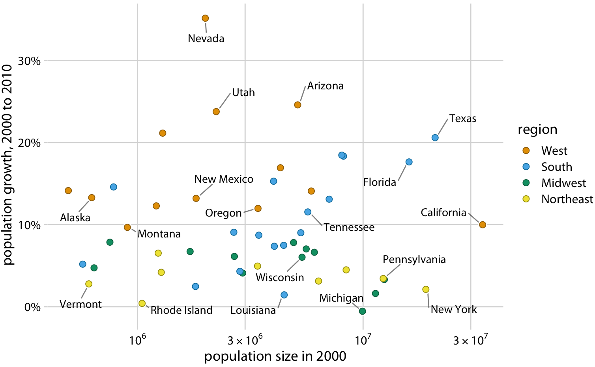

The introductory workshop material is here: [Part 1](https://rpubs.com/bpbond/727254), [Part 2](https://rpubs.com/bpbond/727256).

```{r setup, include=FALSE}
knitr::opts_chunk$set(echo = TRUE)
library(emo)  # install via devtools::install_github("hadley/emo")
library(ggplot2)
thm <- theme_minimal()
theme_set(thm)
drk <- theme(panel.background = element_rect(fill = "gray"))
```

# Topics

* The ggplot2 pipeline
* Plot layers
* The relationship between stats and geoms
* Scales
* Coordinate transformations
* Expressions
* Annotations

**<span style="color: red;">Goal: clearer, more effective data visualizations.</span> This will involve understanding what constitutes a ggplot _layer_, the relationship between _stats_ and _geoms_, and the difference between _scale transformations_ and _coordinate transformations_.**


# Assumptions

**I assume you're familiar with the basic mechanics of ggplot2** as covered in the introductory workshop (links above):

* The fundamentals of R and ggplot2
* Basic data visualization concepts
* Grammar of graphics
* Building a plot: dataset structure, `ggplot()`, aesthetics, geoms, labels, themes, facets
* Aesthetic and theme inheritance principles


# The ggplot2 pipeline

Today we're loosely following the ggplot2 visualization pipeline as [given in Figure 13.2 from the ggplot2 book](https://ggplot2-book.org/mastery.html#fig:schematic). It's important to understand the most important parts of this sequence, because their order determines functionality.


# Plot layers

We think of geoms as layers, and that's usually true, what actually makes up a _plot layer_?

* An optional **mapping** of aesthetics that supplements or overrides the default mapping set in `ggplot()`
* An optional **dataset** that overrides the default plot dataset
* A **geom**: the geometric object used to draw each observation
* A **stat**: the statistical transformation to use (even if it's only the “identity” stat)
* A **position** used to adjust overlapping objects

With this we can start to truly understand the [usage of `geom_point()`](https://ggplot2.tidyverse.org/reference/geom_point.html) for example:
```
geom_point(
  mapping = NULL,
  data = NULL,
  stat = "identity",
  position = "identity",
  ...,
  na.rm = FALSE,
  show.legend = NA,
  inherit.aes = TRUE
)
```

# Datasets and mappings


We're not spending much time on these today.

Key point: different plot layers may, but don't have to, have different data sources and aesthetics that override the plot-level ones defined in `ggplot()`.

## EXERCISE: plot layers

**How was this plots built?** What layers and data sources can you see?


From [Our favorite Pew Research Center data visualizations from 2014](https://www.pewresearch.org/fact-tank/2014/12/29/our-favorite-pew-research-center-data-visualizations-from-2014/)


# Geoms


## mpg

Many of the examples below will use ggplot2's [mpg dataset](https://ggplot2.tidyverse.org/reference/mpg.html).

>This dataset contains a subset of the fuel economy data that the EPA makes available on http://fueleconomy.gov. It contains only models which had a new release every year between 1999 and 2008 - this was used as a proxy for the popularity of the car.

Take a quick look at `mpg` before going farther.

## Fundamentals

Let's talk about **geoms**---geometric objects. They are the fundamental building blocks of ggplot2, and can be put into several categories. There are the basic geoms:

Geom             | Requires | Understands                    | Notes
---------------- | -------- | ------------------------------ | -------
`geom_point()`   | `x`, `y` | `color`, `size`, ...           | cf. `geom_jitter()`
`geom_line()`    | `x`, `y` | `color`, `size`, `linetype`... | cf. `geom_path()`
`geom_bar()`     | `x`, `y` | `color`, `fill`, ...           | cf. `geom_col()`
`geom_area()`    | `x` **or** `y` (also min, max) | `color`, `fill`          | cf. `geom_ribbon()`
Polygon geoms    | `x`, `y` | `color`, `size`, `linetype`... | `geom_rect()`, `geom_tile()`, `geom_polygon()`

```{r basic-geoms, message=FALSE, fig.show="hold", out.width="33%"}
theme_update(title = element_text(size = 20, face = "bold"))
df <- data.frame(x = c(3, 1, 5), 
                 y = c(2, 4, 6))
base <- ggplot(df, aes(x, y)) +
  labs(x = NULL, y = NULL)

base + geom_point() + ggtitle("point")
base + geom_jitter() + ggtitle("jitter")
base + geom_line() + ggtitle("line")
base + geom_path() + ggtitle("path")
base + geom_bar(stat = "identity") + ggtitle("bar")
base + geom_tile() + ggtitle("tile")
base + geom_raster() + ggtitle("raster")
base + geom_polygon() + ggtitle("polygon")
base + geom_area() + ggtitle("area")
```

I would also call these basic, but they have additional aesthetic requirements: `xmin`, `xmax`, `ymin`, and `ymax`:

```{r minmax-geoms, message=FALSE, fig.show="hold", out.width="50%"}
df <- data.frame(x = c(3, 1, 5), 
                 xmin = c(2, 0, 2),
                 xmax = c(4, 3, 5),
                 y = c(2, 4, 6),
                 ymin = c(1, 3, 2),
                 ymax = c(2.5, 5, 6))
base <- ggplot(df, aes(x, y, xmin = xmin, xmax = xmax, ymin = ymin, ymax = ymax)) +
  labs(x = NULL, y = NULL)

base + geom_rect(alpha = 0.5) + ggtitle("rect")
base + geom_ribbon() + ggtitle("ribbon")
base + geom_errorbar() + ggtitle("errorbar")
base + geom_pointrange() + ggtitle("pointrange")
```

## Summarizing geoms

And then there are the basic statistical summary geoms:

```{r ss-geoms, message=FALSE, fig.show="hold", out.width="50%"}
base <- ggplot(mpg, aes(fill = class)) +
  labs(x = NULL, y = NULL) +
  theme(legend.position = "none")

base + geom_histogram(aes(x = displ)) + ggtitle("histogram")
base + geom_density(aes(x = displ)) + ggtitle("density")
base + geom_freqpoly(aes(x = displ)) + ggtitle("freqpoly")
base + geom_boxplot(aes(x = class, y = displ)) + ggtitle("boxplot")
base + geom_violin(aes(x = class, y = displ)) + ggtitle("violin")
base + geom_dotplot(aes(x = class), stackratio = 0.35) + ggtitle("dotplot")
```

Note that geoms can build on each other:

* `geom_histogram()` uses `geom_bar()` but a different statistical summary, `stat_bin()`
* `geom_smooth()` (not shown above) uses `geom_line()` and `geom_ribbon()`

## Overplotting

Whether you use a 'basic' geom, or a statistical summary geom, depends on a number of factors...but one of them is simply data _volume_. When you have so many data points that they're obscuring each other, it's a problem---statistical relationship can be obscured, and the viewer can no longer see the data distribution(s).

At low to moderate data densities, try changing your plot symbol, size, or transparency:

```{r overplot1, fig.show="hold", out.width="50%"}
# Example from https://ggplot2-book.org/statistical-summaries.html#overplotting
df <- data.frame(x = rnorm(4000), y = rnorm(4000))
norm <- ggplot(df, aes(x, y)) + 
  labs(x = NULL, y = NULL) 

norm + geom_point()
norm + geom_point(shape = 1) # Hollow circles
norm + geom_point(shape = ".") # Pixel sized
norm + geom_point(alpha = 0.1) # Pixel sized
```

At higher data densities you'll need two-dimensional density geoms:

```{r overplot2, fig.show="hold", out.width="50%"}
norm + geom_bin2d() + ggtitle("bin2d")
norm + geom_hex() + ggtitle("hex")
norm + geom_hex(bins = 10) + ggtitle("hex (bins = 10)")
norm + geom_density2d() + ggtitle("density2d")

theme_set(thm)
```

## Position adjustments

Each geom has a `position` parameter that specifies how minor and/or group-wise position adjustments are to be handled.

```{r position1, fig.show="hold", out.width="50%"}
theme_update(title = element_text(size = 20, face = "bold"))
base <- ggplot(mpg, aes(cty, fill = class)) + 
  xlab(NULL) + ylab(NULL) + theme(legend.position = "none")

base + geom_bar() + ggtitle("stack") # the default
base + geom_bar(position = "dodge") + ggtitle("dodge")
base + geom_bar(position = "fill") + ggtitle("fill")
base + geom_bar(position = "identity") + ggtitle("identity") +
  theme(panel.background = element_rect(fill = "gray"))
```

Some position adjustments are particularly useful for points:

```{r position2, fig.show="hold", out.width="50%"}
base <- ggplot(mpg, aes(displ, cty, color = class)) + 
  xlab(NULL) + ylab(NULL) + theme(legend.position = "none")

base + geom_point() + ggtitle("identity") # the default
base + geom_point(position = position_nudge(x = 2, y = -2)) + ggtitle("nudge")
base + geom_point(position = "jitter") + ggtitle("jitter")
theme_set(thm)
```

Note that to change the adjustment defaults, you need to construct
a position object with the desired parameters (see `position_nudge()` example above).


# Geoms and stats


**Every geom has a default stat, and every stat has a default geom.**

Most stats take additional parameters to specify the details of statistical transformation; these are usually supplied in `...` (in which case stat and geom parameters are automatically teased apart).

## Geom defaults

The different behavior of different geoms can be seen from their parameter defaults:

Parameter                | `geom_point` | `geom_boxplot` | `geom_histogram` | `geom_abline`
------------------------ | ------------ | -------------- | ---------------- | -------------
mapping                  | NULL         | NULL           | NULL             | NULL
data                     | NULL         | NULL           | NULL             | NULL
stat                     | "identity"   | "boxplot"      | "bin"            | NULL
position                 | "identity"   | "dodge2"       | "stack"          | NULL
show.legend              | NA           | NA             | NA               | NA
inherit.aes              | TRUE         | TRUE           | TRUE             | FALSE

Some questions to think about:

* Why does `geom_abline()` not inherit aesthetics?
* What's the difference between `geom_point()` and `geom_jitter()`? (Look at the help.)
* What’s the difference between `geom_path()` and `geom_polygon()`?
* What about `geom_path()` versus `geom_line()`?

## Changing the `stat`

Geoms have their stats, and stats have their geoms. But we can use alternate stats within geoms, and alternate geoms within stats:

```{r alternate-stat, fig.show="hold", out.width="50%"}
theme_update(title = element_text(size = 20, face = "bold"))
base <- ggplot(mpg, aes(displ, hwy))
base + geom_point() + ggtitle("geom_point")
base + geom_point(stat = "ecdf") + 
  ggtitle('geom_point(stat = "ecdf")')
ggplot(mpg, aes(displ, hwy)) + stat_ecdf() + ggtitle("stat_ecdf")
ggplot(mpg, aes(displ, hwy)) + stat_ecdf(geom = "point") +
  ggtitle('stat_ecdf(geom = "point")')
theme_set(thm)
```

## `stat_summary()`

We can also use `stat_summary()`, a useful (but not all-purpose, see below) tool.

For example, what if we'd like to plot data within groups, but also display the group mean? We could summarize the data separately, and then add second `geom_point(data = ...)` call, but there's a slicker way.

```{r stat-summary}
ggplot(mpg, aes(class, hwy, color = displ)) + 
  geom_jitter() + 
  # stat_summary(fun = "mean", geom = "point", color = "red", size = 4)
  geom_point(stat = "summary", fun = "mean", color = "red", size = 4)
```

You might ask whether the summary point can be assigned a color corresponding to the mean of its group---i.e., whether we can use `stat_summary` to compute _both_ `mean(hwy)` and `mean(displ)`. As far as I know this is not possible; you would need to pre-compute a separate summary dataset:

```{r mpg-agg}
mpg_agg <- aggregate(list(hwy = mpg$hwy, displ = mpg$displ),
                     by = list(class = mpg$class), mean)
ggplot(mpg, aes(class, hwy, color = displ)) + 
  geom_jitter() + 
  geom_point(data = mpg_agg, size = 4)
```

## EXERCISE: stat_summary

In addition to using built-in functions like `mean` that return a single value, `stat_summary` can use a user-provided function that returns three values:

>`fun.data`: A function that is given the complete data and should return a data frame with variables ymin, y, and ymax.

**Starting from `ggplot(mpg, aes(class, hwy, color = displ))`, write a custom summary function to produce the following graph that shows each group's median and standard deviation:**

```{r exercise-stat-summary}
my_smry <- function(y) { 
  ysd <- sd(y, na.rm = TRUE)
  ymd <- median(y, na.rm = TRUE)
  data.frame(y = ymd, ymin = ymd - ysd, ymax = ymd + ysd)
}

ggplot(mpg, aes(class, hwy, color = displ)) + 
  geom_jitter() + 
  geom_pointrange(stat = "summary", fun.data = "my_smry", color = "red")
```

Finally, though, I tend not to use the explicit `stat_*` functionality of ggplot2 all that much; in general I find it simpler and clearer to pre-compute my summary statistics and then visualize them using the default geoms. YMMV however. 


# Scales


From the ggplot2 [book](https://ggplot2-book.org/scales-guides.html#scales-guides):

>Formally, each scale is a function from a region in data space (the domain of the scale) to a region in aesthetic space (the range of the scale). The axis or legend is the inverse function: it allows you to convert visual properties back to data.

* Every aesthetic in a plot is associated with exactly one scale.
* The default scale depends on the aesthetic and the variable type. 
* If you supply two scales for the same aesthetic, the last takes precedence.
* Scale functions are of the form `scale_<aesthetic>_<type of scale>()`
* There are continuous scales, discrete scales, and _binned_ scales

## Changing scales {.tabset}

Continuous and discrete scale functions have some parameters that are often used:

* `name` - change the title of the axis or legend
* `breaks` - tick locations (on an axis) or legend keys
* `labels` - customize labels on ticks or legend keys
* `limits` - change the scale range

NOTE that the `limits` argument will **drop data** outside of the new limits, because of where this happens in the ggplot2 pipeline; see above.

### cars

```{r scale-changes0}
base <- ggplot(cars, aes(speed, dist)) + geom_point()
base
```

### `name`

```{r scale-changes1}
base + scale_x_continuous(name = "New name")
```

### `breaks`

```{r scale-changes2}
base + scale_x_continuous(breaks = c(7, 12, 13, 18, 24))
```

### `labels`

```{r scale-changes3}
base + scale_x_continuous(labels = c("", "This", "isn't", "a", "good", "idea"))
```

### `limits`

**Notice the warning that occurs here. Why?**

Because by default, ggplot2 converts data outside the scale limits to NA, which can affect subsequent stats and geoms. This behavior can be changed; see `scales::oob`.

```{r scale-changes4}
base + scale_x_continuous(limits = c(10, 20))
```

## Scale labels

The example above used a manually specified vector of labels. We can also use a _labelling function_; the `scales` package provides some really useful ones:

```{r labeller-functions, warning=FALSE, fig.show='hold', results='hold'}
library(scales)

label_dollar()(2004)
label_comma()(2004)
label_percent()(2004)
label_bytes()(2004)

ggplot(cars, aes(speed, dist, color = speed)) + 
  geom_point() +
  scale_x_continuous(labels = label_percent()) +
  scale_y_continuous(labels = label_dollar()) +
  scale_color_continuous(labels = label_ordinal())
```

We can also write our own labeling function:

```{r}
metric_label <- function(x) {
  # convert mpg to km/l
  round(x * 1.6 * 0.264172, 2)
}

ggplot(mpg, aes(displ, hwy)) + 
  geom_point() + 
  scale_y_continuous(labels = metric_label) +
  ylab("Km per liter")
```

Note that this _only_ changes the labels on the lines. We could also have created a custom scale or a custom coordinate transform (see below).

## Scale transformations

Continuous data are by default mapped linearly from the data space onto the aesthetic space, but this can be overridden using transformations via the `trans` argument:

| Name      | Function $f(x)$         | Inverse $f^{-1}(y)$
|-----------|-------------------------|------------------------
| exp       | $e ^ x$                 | $\log(y)$
| identity  | $x$                     | $y$
| log       | $\log(x)$               | $e ^ y$
| log10     | $\log_{10}(x)$          | $10 ^ y$
| logit     | $\log(\frac{x}{1 - x})$ | $\frac{1}{1 + e(y)}$
| pow10     | $10^x$                  | $\log_{10}(y)$
| sqrt      | $x^{1/2}$               | $y ^ 2$

For many of these there are three ways to accomplish a scale-transformation task, e.g.:

* `scale_x_continuous(trans = "log10")`
* `scale_x_log10()`
* `aes(log10(x), ...)`

These all do the same thing, transforming the data _before_ any statistical summaries. Axis labeling may change however:

* if you use a transformed scale, the axes will be labelled in the original data space
* if you transform the data, the axes will be labelled in the transformed space.

```{r scale-transform, fig.show="hold", out.width="50%"}
# untransformed
theme_update(axis.text.y = element_text(size = 20, face = "bold"),
             title = element_text(size = 20, face = "bold"))
df <- data.frame(x = 1:50, y = 1:50)

ggplot(df, aes(x, y, group = 1)) + 
  geom_boxplot() + geom_point() + 
  ggtitle("untransformed")

# manual transformation
ggplot(df, aes(x, log10(y), group = 1)) + 
  geom_boxplot() + geom_point() + 
  ggtitle("aes(log10(y))")

# transform using scales
ggplot(df, aes(x, y, group = 1)) + 
  geom_boxplot() + geom_point() + 
  scale_y_continuous(trans = "log10") + 
  ggtitle('trans = "log10"')

# coordinate transformation
ggplot(df, aes(x, y, group = 1)) + 
  geom_boxplot() + geom_point() + 
  coord_trans(y = "log10") +
  ggtitle('coord_trans(y = "log10")') + drk
theme_set(thm)
```

Less common is to transform color or size scales. An example from the [ggplot2 book](https://ggplot2-book.org/scales-guides.html#scale-transformation-extras):

```{r color-transform, fig.show="hold", out.width="50%"}
base <- ggplot(faithfuld, aes(waiting, eruptions)) + 
  geom_raster(aes(fill = density)) + 
  scale_x_continuous(NULL, NULL, expand = c(0, 0)) +
  scale_y_continuous(NULL, NULL, expand = c(0, 0))

base
base + scale_fill_continuous(trans = "sqrt")
```

We can also create our own [custom scale transformations](https://scales.r-lib.org//reference/trans_new.html), but this is beyond the scope of this workshop.

## Discrete scales

Generally ggplot will automatically map categorical data to a discrete scale, and we don't have to think further about it.

I didn't know that you can selectively replace categorical labels:

```{r}
ggplot(mpg, aes(x = hwy, y = class)) + 
  geom_point() + 
  scale_y_discrete(labels = c(midsize = "Ben's car"))
```

## Binned scales

I did not know these existed! They do.

```{r binned-scale, fig.show="hold", out.width="50%"}
base <- ggplot(mpg, aes(hwy, class)) + geom_count()

base 
base + scale_x_binned(n.breaks = 10)
```

## Reordering categories

By default ggplot2 puts categorical factors into alphabetical order, but you might want to change this; commonly, for example, we'd like to order by the value of some other variable.

This can be done in base R but the `forcats` package offers a super-simple method:

```{r}
ggplot(mpg, aes(class, cty, color = class)) + 
  geom_jitter(show.legend = FALSE)

library(forcats)  # h/t SCP
ggplot(mpg, aes(fct_reorder(class, cty), cty, color = class)) + 
  geom_jitter(show.legend = FALSE)
```

## Color

There are lots of ways to specify color; for example the HCL (hue-chroma-luminance) space.

```{r}
# Example from http://sape.inf.usi.ch/quick-reference/ggplot2/colour
d <- expand.grid(h = seq(0, 350, 10), c = seq(0, 100, 5), l = seq(0, 100, 20))
ggplot(d) +
  coord_polar(theta = "x") + facet_wrap(~l) +
  scale_x_continuous(name = "hue", limits = c(0, 360), 
                     breaks = seq(5, 345, 20), labels = seq(0, 340, 20)) +
  scale_y_continuous(name = "chroma", breaks = seq(0, 100, 20)) +
  scale_fill_identity() +
  geom_rect(mapping = aes(xmin = h, 
                          xmax = h + resolution(h), 
                          ymin=c, 
                          ymax = c + resolution(c),  
                          fill = hcl(h, c, l)), 
            color = "white", size = 0.1)
```

To set a different continuous color scale:

* `scale_fill/color_gradient()` produces a two-color gradient
* `scale_fill/color_gradient2()` produces a three-color gradient with specified midpoint
* `scale_fill/color_gradientn()` produces an n-color gradient
* `scale_fill/color_distiller()` and `scale_fill/color_brewer()` provide color schemes from [ColorBrewer](https://colorbrewer2.org/)

```{r faithfuld-color, fig.show="hold", out.width="50%"}
base <- ggplot(faithfuld, aes(waiting, eruptions, fill = density)) +
  geom_raster() +
  scale_x_continuous(NULL, expand = c(0, 0)) + 
  scale_y_continuous(NULL, expand = c(0, 0)) + 
  theme(legend.position = "none")

base
base + scale_fill_viridis_c()
base + scale_fill_viridis_c(option = "magma")
base + scale_fill_distiller(palette = "RdPu")
base + scale_fill_distiller(palette = "YlOrBr")
base + scale_fill_gradient2()
```

**How do you know what colors to use?** On a technical level, there are several useful tools:

* Mac users have the "Digital Color Meter" in their Utilities folder; so handy!
* R provides functions like `hcl()` that return the RGB (red-green-blue) hex code for a combination of hue, chroma, and luminance
* The `scales::show_col()` provide "A quick and dirty way to show colours in a plot"

```{r show_col, out.width="75%"}
scales::show_col(hue_pal()(9))
```

More fundamentally, however, it's time for...

## Color crash course

> "There are three fundamental use cases for color in data visualizations: (i) we can use color to distinguish groups of data from each other;  (ii) we can use color to represent data values; and (iii) we can use color to highlight." - Claus Wilke, _Fundamentals of Data Visualization_



The **tl;dr** of color theory is that color choices matter, and will create more impactful figures to communicate research more effectively. Colors opposite each other on the color star above are _complementary_ and look good together. Why? Because [SCIENCE](https://www.smithsonianmag.com/smart-news/the-scientific-reason-complementary-colors-look-good-together-114030051/). Photoreceptor cells in your eyes like **balance**.

### 1. Be consistent 



From: [How to Choose Colors for Your Data Visualizations](https://medium.com/nightingale/how-to-choose-the-colors-for-your-data-visualizations-50b2557fa335) by Michael Yi 

Keep variables the same color throughout a presentation or paper. This helps viewers understand and follow the **story of your data** throughout.

### 2. Be intentional

The following example is from Claus Wilke's [Fundamentals of Data Visualization book](https://clauswilke.com/dataviz/index.html) (which I highly recommend) **Why is this figure "bad"?**


> "Even if with a lot of effort we can figure out exactly which state is which, this visualization defeats the purpose of coloring. 
> We should use color to enhance figures and make them easier to read, not to obscure the data by creating visual puzzles."

Coloring the points by region offers an additional way to _interpret_ the data. Don't color for the sake of coloring. **Color should have a clear purpose in a figure.**



### 3. Be inclusive

Many people (~10% of men) do not possess the normal complement of color receptors and so can distinguish fewer colors than usual. 

- https://colorbrewer2.org/ allows you to filter through `colorbrewer` palettes and select colorblind safe, print friendly, and/or photocopy safe colors
- `viridis` is a popular color palette package that is colorblind-friendly
- The `colorblindr` and `dichromat` packages shows what your plot looks like in different color-vision-deficiency simulations


# Guides

Legends and axes are collectively referred to as "guides" in the ggplot2 system, and are the inverse of scales: they map visual properties back to the underlying data.

**The single most common Google search I perform is "ggplot remove legend", so let's get that out of the way:**

* Hide the entire legend: `p + theme(legend.position = "none")`
* Hide the legend for a specific geometry: `p + geom_xxx(show.legend = FALSE)`

Legend positioning is changed via the theme system.

More generally, legends are _complicated_, both over and under the hood.

One useful trick to know about is the `override.aes` parameter of `guide_legend()`.

```{r override.aes, fig.show="hold", out.width="50%"}
base <- ggplot(mpg, aes(displ, hwy, color = class)) + 
  geom_point() +
  theme(legend.position = c(0.75, 0.75))

base
base + guides(colour = guide_legend(override.aes = list(size = 5)))
```

While working on this I wondered if the legend text entries could be colored to follow a plot aesthetic. Answer: it's [possible but a bit gnarly](https://stackoverflow.com/questions/23588127/match-legend-text-color-in-geom-text-to-symbol).


# Coordinate systems


Most often we work with the default Cartesian coordinate system, `coord_cartesian()`. Two other common and useful systems are:

* `coord_flip()` flips the x and y axes. Note that this is _not_ the same thing as plotting y against x
* `coord_fixed()` is the Cartesian system with a fixed aspect ratio

There are also specialized _non-linear coordinate systems_, in which the closest distance between two points may no longer be a straight line. These systems may thus change the very shape of geoms.

* `coord_map()` and `coord_sf()` and for map projections
* `coord_polar()` produces polar coordinates
* `coord_trans()` allows you to apply arbitrary transformations to x and y

```{r funky-rect, fig.show="hold", out.width="50%"}
rect <- data.frame(x = 50, y = 50)
line <- data.frame(x = c(1, 200), y = c(100, 1))
base <- ggplot(mapping = aes(x, y)) + 
  geom_tile(data = rect, aes(width = 50, height = 50)) + 
  geom_line(data = line) + 
  xlab(NULL) + ylab(NULL)
base + ggtitle("Cartesian")
base + coord_flip() + ggtitle("coord_flip")
base + coord_polar("x") + ggtitle("Polar x")
base + coord_trans(y = "log10") + ggtitle('coord_trans(y = "log10")')
```

(Modified from an [example](https://ggplot2-book.org/coord.html#coord-non-linear) in the ggplot2 book.)

## EXERCISE: coordinate flipping

Is flipping the x and y coordinates the same thing as exchanging the x and y aesthetic mappings? 

**Use the `cars` dataset and `geom_smooth()` to test this.**

```{r coord-flip, fig.show="hold", out.width="50%", message=FALSE}
p <- ggplot(cars, aes(speed, dist)) + geom_point() + geom_smooth()
p
p + coord_flip()
ggplot(cars, aes(dist, speed)) + geom_point() + geom_smooth() + drk
```

## Coordinate limits

**'Zooming into' a part of the plot is a coordinate transform, not a scale adjustment.**

`coord_cartesian(xlim = c(x1, x2))`

`coord_cartesian(ylim = c(y1, y2))`

`coord_cartesian(xlim = c(x1, x2), ylim = c(y1, y2))`

```{r zoom, fig.show="hold", out.width="50%", message=FALSE, warning=FALSE}
theme_update(title = element_text(size = 20, face = "bold"))

p <- ggplot(mpg, aes(displ, cty)) + geom_point() + geom_smooth()
p + geom_vline(xintercept = 4, linetype = 2) + geom_vline(xintercept = 6, linetype = 2)
p + xlim(c(4, 6)) + drk + ggtitle("xlim")
p + scale_x_continuous(limits = c(4, 6)) + drk + ggtitle("scale limits")
p + coord_cartesian(xlim = c(4, 6)) + ggtitle("coord_cartesian")
theme_set(thm)
```


# Annotations


Good annotations guide and clarify for your viewers, and you should know ggplot2's `annotate()` function.

For example, we may want to annotate individual points:

```{r}
ggplot(mpg, aes(displ, hwy)) +
  geom_point(data = subset(mpg, manufacturer == "subaru"), 
             colour = "orange",
             size = 3) +
  geom_point() + 
  annotate(geom = "curve", 
           x = 4, y = 35, xend = 2.65, yend = 27, 
           curvature = 0.3, arrow = arrow(length = unit(2, "mm"))) +
  annotate(geom = "text", x = 4.1, y = 35, label = "subaru", hjust = "left")
```

This can be very effective across facets:

```{r}
ggplot(mpg, aes(displ, hwy)) +
  geom_point(data = mpg[c("displ", "hwy")], color = "grey") +
  geom_point(aes(colour = factor(cyl))) +
  facet_wrap(~cyl)
```

Shading can provide a _very_ effective way to annotate data:

```{r economics}
pres <- subset(presidential, start >= economics$date[1])

ggplot(economics) + 
  geom_rect(data = pres, 
            alpha = 0.3, 
            # notice the "-Inf" and "Inf" y limits here
            aes(xmin = start, xmax = end, ymin = -Inf, ymax = Inf, fill = party)) +
  geom_line(aes(date, unemploy / pop)) + 
  scale_fill_manual(values = c("blue", "red")) +
  scale_y_continuous(labels = label_percent()) +
  geom_text(data = pres, angle = 30, size = 3, hjust = 0, nudge_x = 50,
            aes(x = start, y = 0.025, label = name))
```

## Other useful packages

The `ggrepel` package provides a useful variant on `geom_text` that attempts to space text labels out nicely:

```{r ggrepel, fig.show="hold", out.width="50%"}
base <- ggplot(mtcars,
  aes(wt, mpg, label = rownames(mtcars), colour = factor(cyl))) +
  geom_point() + 
  theme(legend.position = "none")

base + geom_text()
base + ggrepel::geom_text_repel()
```

We can also use the `ggforce` package to label entire groups:

```{r ggforce}
ggplot(mpg, aes(displ, hwy)) +
  geom_point(aes(color = class)) + 
  ggforce::geom_mark_ellipse(aes(label = cyl, group = cyl))
```

`ggpmisc` provide a `geom_table()` and (like the `cowplot` and `patchwork` packages) facilities for making inset tables and plots:

```{r ggpmisc, warning=FALSE}
library(ggpmisc)

tb <- aggregate(list(hwy = mpg$hwy, cty = mpg$cty), by = list(cyl = mpg$cyl), median)
data.tb <- tibble::tibble(x = 6, y = 44, tb = list(tb))

ggplot(mpg, aes(displ, hwy, colour = factor(cyl))) +
  geom_table(data = data.tb, aes(x, y, label = tb)) +
  geom_point() 
```

## Math

We can include arbitrary mathematical expression in almost any text in ggplot2: axis and legend titles, facet titles, legend entries. This uses R's `plotmath()` facility and interprets a text argument as a mathematical expression. 

[This page](https://astrostatistics.psu.edu/su07/R/html/grDevices/html/plotmath.html) has a handy list of plotmath examples; see also `?plotmath`.

How this is implemented in ggplot2 can feel frustratingly arbitrary, and I find myself experimenting and googling a lot:

```{r plotmath}
ggplot(mpg, aes(displ, hwy, color = class)) + geom_point() +
  # Axis labels will parse expressions by default
  xlab(expression(paste(Displacement~hat(x), " (in", phantom()^3, ")"))) +
  # Another way
  labs(y = quote(Highway~(mu))) +
  scale_color_discrete(labels = c(expression(alpha), 
                                  expression(beta), 
                                  expression(gamma)))
```

It is also possible to include Markdown in axis and legend titles using the `ggtext` package.

```{r markdown, fig.show="hold", out.width="50%", warning=FALSE}
library(ggtext)
df <- data.frame(x = 1:3, y = 1:3)
base <- ggplot(df, aes(x, y)) + 
  geom_point() + 
  labs(x = "Axis title with *italics* and **boldface**") +
  theme(axis.title.x = element_text(size = 20))

base 
base + theme(axis.title.x = ggtext::element_markdown())
```

# End

Things we didn't talk about:

* Maps, networks, 3D plots
* Polar coordinates (much)
* Assembling multiple plots together. My go-to is [cowplot](https://wilkelab.org/cowplot/articles/plot_grid.html) but the newer [patchwork](https://patchwork.data-imaginist.com/) is worth checking out.

Resources

* The [ggplot2 book](https://ggplot2-book.org/index.html). No, really
* The [repository](https://github.com/JGCRI/Rworkshops) for this presentation, including its [RMarkdown file](https://github.com/JGCRI/Rworkshops/blob/master/ggplot2-intermediate.Rmd)
